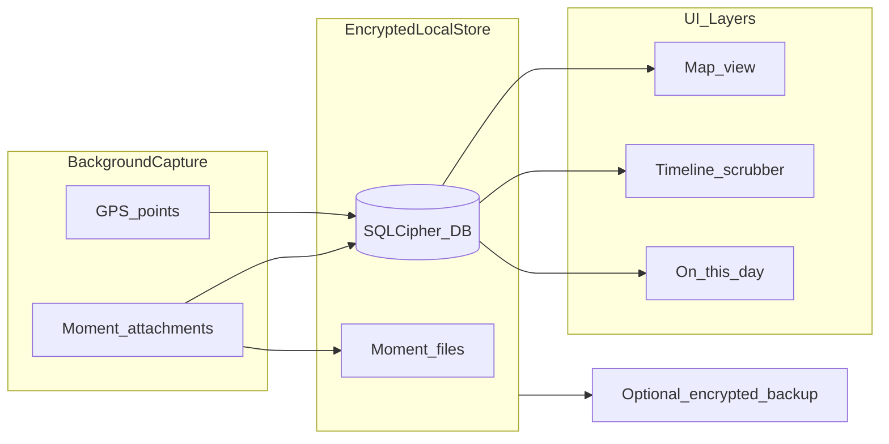
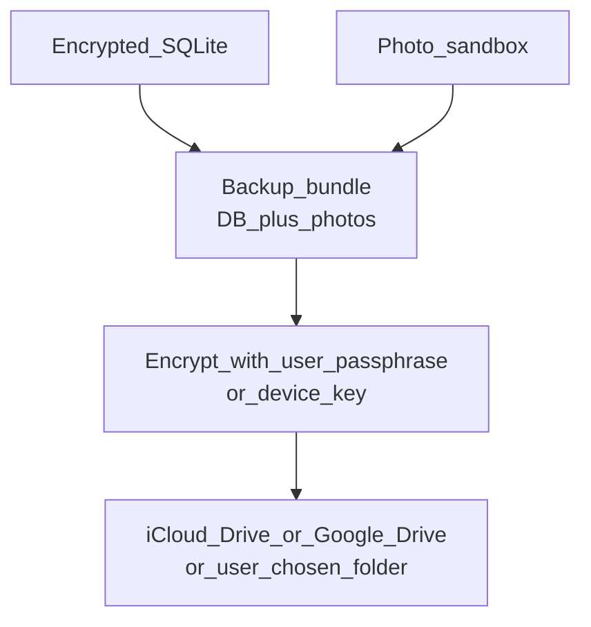
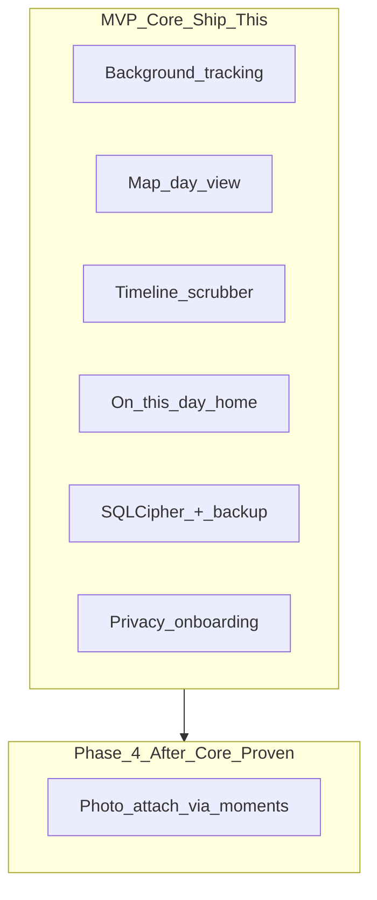
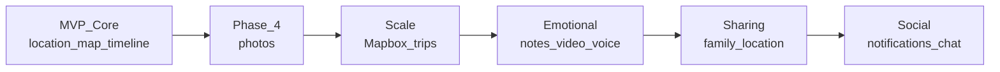
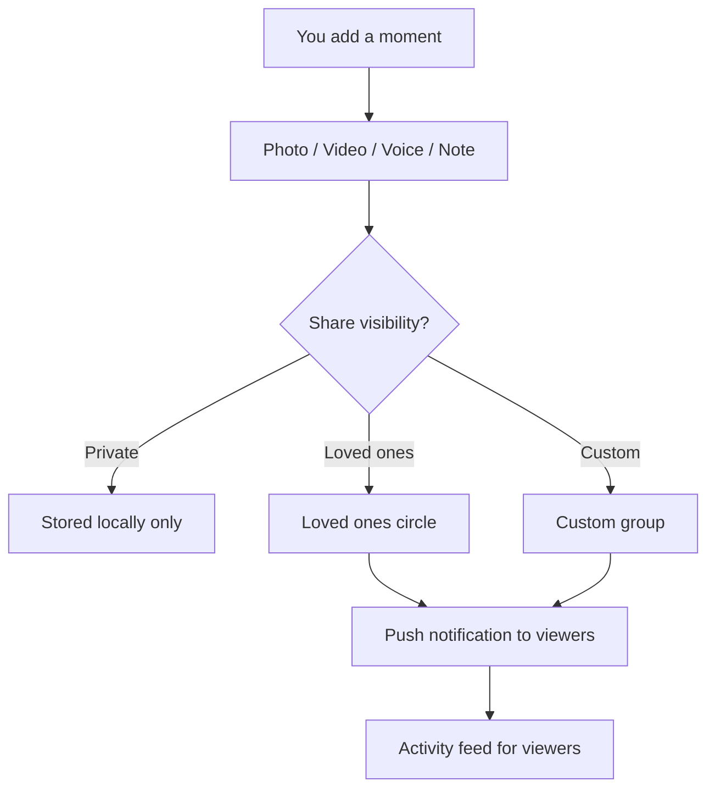

# LifeMap App — React Native Foundation & Long-Term Stack

## What you're building

A **personal life timeline** app (think: Google Timeline + Day One + photos), focused on emotional recall:

> "Where was I last year today?" / "What did yesterday look like on a map?"

Your core loop:



---

## UI foundation — will you regret it?

### What great companies actually do

Most production React Native apps **do not** depend on a full third-party UI kit end-to-end. They use:

| Company / app style | Typical approach |
|---|---|
| Shopify, Coinbase, Discord, Uber | Custom design system on **primitives** (Reanimated, Gesture Handler, own tokens) |
| Startups shipping fast | **Styling layer** (NativeWind or Tamagui) + **headless/unstyled components** |
| Internal/enterprise tools | Paper, Gluestack, or Kitten for speed over brand |

**Takeaway:** Your risk is not "wrong button library" — it's picking something that **locks your visual identity** or **fights map-heavy custom layouts**.

### Compare the options you listed

| Library | Good for | Weak for your app | Regret risk |
|---|---|---|---|
| **React Native Paper** | Material Design, forms, settings screens | Warm, emotional, map-first aesthetic; feels "Google app" | Medium — you'll fight MD3 look |
| **Gluestack UI v3** | Accessible primitives + NativeWind | Less opinionated beauty out of the box | Low if paired with NativeWind |
| **NativeBase (legacy)** | — | Superseded by Gluestack; avoid starting new | High |
| **React Native Elements** | Simple CRUD apps | Dated; limited design polish | Medium–High |
| **UI Kitten (Eva)** | Theming, dashboards | Feels corporate; smaller modern community | Medium |
| **Tamagui** | Custom brand, animations, performance, optional web later | Steeper learning curve | Low — very flexible |

### NativeWind vs Gluestack vs Tamagui — deep dive

These are **three different layers**. Confusion comes from mixing them up:

| Layer | What it does | Examples |
|---|---|---|
| **Styling engine** | How you write styles (`className="flex-1 bg-rose-500"`) | NativeWind, Tamagui styled(), StyleSheet |
| **Component library** | Pre-built Button, Modal, Sheet, Input with behavior + a11y | Gluestack, Tamagui UI, React Native Reusables |
| **Design tokens** | Colors, spacing, fonts shared across app | Your `theme/` folder, or Tamagui tokens |

#### NativeWind alone is enough

**NativeWind is NOT a component library.** It is Tailwind CSS for React Native — it compiles `className` props into native `StyleSheet` at build time. You get the Tailwind workflow you already like.

You do **not** need Gluestack to use NativeWind. You can style raw `<View>`, `<Text>`, `<Pressable>` with Tailwind classes directly.

### NativeWind v5 — confirmed stack choice

**Decision:** Bare RN + **NativeWind v5 (preview)** — no v4 → v5 migration later.

Docs: [nativewind.dev/v5](https://www.nativewind.dev/v5) | Migration reference: [v5 migrate guide](https://www.nativewind.dev/v5/guides/migrate-from-v4)

> v5 is pre-release. Acceptable tradeoff: you get Tailwind v4, latest RN styling features, and no future migration. Reusables maintainer confirms v5 works following NativeWind migration steps.

| Requirement | Version |
|---|---|
| React Native | **0.81+** |
| New Architecture | **Required** (Fabric + TurboModules) |
| Reanimated | **v4+** |
| Tailwind CSS | **v4.1+** via PostCSS |
| NativeWind | `nativewind@preview` |
| Peer dep | `react-native-css` |

**Bare RN v5 setup (not Expo):**

```bash
# Core styling
npm install nativewind@preview react-native-css react-native-reanimated react-native-safe-area-context
npm install --save-dev tailwindcss @tailwindcss/postcss postcss

# package.json — pin lightningcss to avoid build errors
"overrides": { "lightningcss": "1.30.1" }
```

**global.css** (Tailwind v4 syntax):
```css
@import "tailwindcss/theme.css" layer(theme);
@import "tailwindcss/preflight.css" layer(base);
@import "tailwindcss/utilities.css";
@import "nativewind/theme";
```

**postcss.config.mjs** — required for v5:
```js
export default { plugins: { "@tailwindcss/postcss": {} } };
```

**metro.config.js** — bare RN:
```js
const { getDefaultConfig, mergeConfig } = require('@react-native/metro-config');
const { withNativewind } = require('nativewind/metro');
const config = mergeConfig(getDefaultConfig(__dirname), {});
module.exports = withNativewind(config);
```

**babel.config.js** — bare RN (no nativewind/babel preset in v5):
```js
module.exports = { presets: ['module:@react-native/babel-preset'] };
```

**Reusables with v5:**
```bash
npx @react-native-reusables/cli@latest add button text --styling-library nativewind
```

**v5 API notes for LifeMap:**
- `className` — unchanged, use everywhere
- `cssInterop` / `remapProps` → use `styled()` instead (Reusables may still ship cssInterop — wrap or update as needed)
- Theme variables → CSS `@theme` in global.css + `VariableContextProvider` for dynamic themes
- Icons: use Reusables `Icon` component or `styled()` for Lucide icons

NativeWind alone gives you **styling only** — `className="flex-1 bg-rose-500 rounded-2xl"`. Reusables provides components.

### Reusables vs Gluestack vs NativeWindUI — final decision

Three separate products in the NativeWind ecosystem:

| Product | Cost | What it is | Best for |
|---|---|---|---|
| **React Native Reusables** | Free, open source | shadcn-style copy-paste components (Button, Sheet, Dialog, Input) | Generic modern UI, you own the code |
| **Gluestack UI v3** | Free, open source | Enterprise headless components + CLI | Large teams, design systems, Figma workflow |
| **NativeWindUI** | $99/qtr or **$299 lifetime** | Premium platform-native components + full screen templates | Professional iOS/Android native feel |

**Skip Gluestack.** It solves the same problem as Reusables but with more enterprise overhead. For a solo dev who likes Tailwind/shadcn, Gluestack adds complexity without a clear win. Reusables is lighter, more popular (8k+ GitHub stars), and closer to the mental model you already know.

**NativeWindUI is NOT a replacement for Reusables — it's a premium upgrade layer.**

Built by the same people behind NativeWind and Reusables ([nativewindui.com](https://nativewindui.com)):
- 30+ platform-specific components (Action Sheet, Alert, Bottom Tabs, Adaptive Search Header)
- Full screen templates (Settings, Profile, Authentication, Messaging flows)
- iOS components feel like iOS; Android uses Material 3
- Copy-paste model — code is yours, no npm lock-in
- CLI to install components + native deps

**Recommended stack for "professional, modern, no design compromise":**

```
NativeWind v5          →  Tailwind v4 styling everywhere
React Native Reusables →  Free base (Sheet, Dialog, Button, Input, forms)
React Navigation       →  Bottom tabs (custom tab bar styled with NativeWind + Lucide)
Your custom components →  Map, timeline, photo viewer (unique to LifeMap)
```

| Screen type | Use |
|---|---|
| Map, timeline, "On this day", photo gallery | **Custom** with NativeWind classes (your app's soul) |
| Generic dialogs, bottom sheets, form inputs | **Reusables** (free, fast to add) |
| Bottom tab navigation | **React Navigation** + custom `TabBar` (NativeWind + Lucide) |

**Why not Gluestack + NativeWindUI?** Three styling/component systems is redundant. Reusables + NativeWindUI cover everything Gluestack would, with better Tailwind alignment.

**Why NativeWindUI is worth $299 for you:** You said no compromise on design. NativeWindUI's Settings (Apple style), Profile, and Bottom Tabs templates alone save weeks of polish work. Lifetime license, unlimited projects.

Free tier exists: [github.com/roninoss/nativewindui](https://github.com/roninoss/nativewindui) — try free components before buying.

### Recommended foundation (confirmed)

**Final UI stack:**

- **Bare React Native CLI 0.81+ + TypeScript**
- **New Architecture enabled**
- **NativeWind v5** (`nativewind@preview` + `react-native-css` + Tailwind v4 PostCSS)
- **React Native Reusables** — `--styling-library nativewind`
- **React Navigation v7** — `@react-navigation/bottom-tabs` + custom tab bar
- **Lucide React Native** — icons (via Reusables `Icon` / `styled()`)
- **React Native Reanimated v4 + Gesture Handler**
- **@shopify/flash-list**

### Bottom tabs (Reusables doesn't include them)

Reusables has no tab navigator — use **React Navigation**:

```tsx
<Tab.Navigator tabBar={(props) => <CustomTabBar {...props} />}>
  <Tab.Screen name="Home" component={HomeScreen} />      {/* Sparkles — On this day */}
  <Tab.Screen name="Map" component={MapScreen} />        {/* Map */}
  <Tab.Screen name="Timeline" component={TimelineScreen} /> {/* Clock */}
  <Tab.Screen name="Settings" component={SettingsScreen} /> {/* Settings */}
</Tab.Navigator>
```

`CustomTabBar` = NativeWind-styled component + Lucide icons. Full design control, matches Reusables aesthetic.

### Icons — Lucide (via Reusables)

**Use `lucide-react-native`** — the icon set React Native Reusables is built around. Same icons as shadcn/ui on web.

| Package | Role |
|---|---|
| `lucide-react-native` | 1,600+ SVG icons as React components |
| `react-native-svg` | Required peer dep (icons render as native SVG) |
| `@/components/ui/icon` | Reusables wrapper — enables `className` on icons via NativeWind |

**Setup** (during scaffold):

```bash
npm install lucide-react-native react-native-svg
npx @react-native-reusables/cli@latest add icon
```

**Usage:**

```tsx
import { Icon } from '@/components/ui/icon';
import { MapPin, Camera, Calendar, Settings } from 'lucide-react-native';

<Icon as={MapPin} className="size-5 text-primary" />

<Button size="icon" variant="outline">
  <Icon as={Settings} className="size-4" />
</Button>
```

**LifeMap icon picks:** `MapPin`, `Map`, `Navigation`, `Clock`, `Calendar`, `History`, `Camera`, `Image`, `Sparkles`, `Settings`, `Locate`, `Shield`, `Lock`

**Why Lucide:** Tree-shakeable, minimal stroke style matches Reusables, NativeWind `className` support, same as shadcn web.

---

## Long-term tech stack (2026-ready, bare React Native)

### Core platform

| Layer | Choice | Why |
|---|---|---|
| Framework | **React Native CLI 0.81+** (bare workflow) | Required for NativeWind v5 |
| Language | **TypeScript (strict)** | Non-negotiable for a data-heavy app |
| Architecture | **New Architecture** (Fabric + TurboModules) | **Required** for NativeWind v5 |
| Styling | **NativeWind v5** + Tailwind v4 + PostCSS | `nativewind@preview`, `react-native-css` |
| Navigation | **React Navigation v7** (native stack + custom bottom tabs) | Industry standard; deep links via `linking` config |
| Builds/CI | **Fastlane** + GitHub Actions (or Bitrise/Codemagic) | Replaces EAS; automates TestFlight/Play Store |
| Package manager | **pnpm** or **yarn** | Your preference |

**Bare RN tradeoff (honest):** You own `ios/` and `android/` folders — more setup for permissions, background modes, SQLCipher, maps API keys. You gain zero Expo lock-in and direct native access (important for background location).

### Location — why TransistorSoft? (deep dive)

Your app's entire value proposition is: **"log where I was, reliably, for years."** That is one of the hardest problems in mobile development. Here is why free alternatives fall short and what TransistorSoft actually solves.

#### What iOS and Android actually allow

Both OSes **aggressively kill background apps** to save battery. Standard APIs have hard limits:

| Approach | What happens in real life |
|---|---|
| **react-native-geolocation-service** (foreground only) | Stops when app is backgrounded or killed |
| **RN community geolocation + setInterval** | iOS suspends JS timers within minutes; huge gaps in your timeline |
| **expo-location + TaskManager** (not using Expo, but same class of API) | Better than raw, but still struggles with app termination and precise intervals on iOS |
| **Android Fused Location alone** | Works better on Android, but iOS remains broken; no unified cross-platform motion logic |
| **Background Fetch (~15 min minimum)** | Too coarse for "every 30s" or "every 1m" — fine for sync, not life logging |

Your feature list includes **30-second intervals**. No free RN library reliably delivers that across both platforms when the app is killed, the phone reboots, or the user hasn't opened the app in days.

#### What TransistorSoft does differently

It is a **native SDK** (Swift/Kotlin) with a JS wrapper — not a thin wrapper around OS APIs. Used by 21,000+ apps. Key capabilities:

1. **Motion detection** — Uses accelerometer/gyroscope to detect moving vs stationary. When you're still, GPS turns **off** (saves battery). When you move, tracking resumes automatically.

2. **Survives app termination** — `stopOnTerminate: false` keeps tracking after user swipes app away. `startOnBoot: true` resumes after phone restart without opening the app.

3. **Persistent SQLite queue** — Every location saved to native SQLite before your JS runs. If JS crashes, data isn't lost.

4. **Battery-aware scheduling** — OS-level headless tasks on Android; iOS background location modes configured correctly.

5. **Configurable intervals** — `distanceFilter`, `locationUpdateInterval`, `fastestLocationUpdateInterval` map directly to your 30s / 1m / 5m presets.

6. **Geofencing, odometer, activity type** — Bonus features for future trip detection ("driving vs walking").

#### Can you skip it and build yourself?

Technically yes, but you'd be reimplementing 2–3 months of native iOS/Android edge cases:

- iOS `CLLocationManager` always authorization + background modes + App Store review copy
- Android foreground service notification (required for background location)
- Doze mode, battery optimization whitelisting
- Motion vs GPS coordination
- Headless JS on Android when app is killed

For a solo dev, **$299–399 one-time** vs months of native debugging is usually the right trade.

#### Try before you buy

The SDK is **fully functional in DEBUG builds without a license**. You can validate on real devices before purchasing. Only RELEASE/production builds need a license key.

#### Bare RN setup (no Expo plugin)

```bash
npm install react-native-background-geolocation
cd ios && pod install
```

Then manual native config per [TransistorSoft docs](https://docs.transistorsoft.com/react-native/setup/):

- **iOS:** `Info.plist` — `NSLocationAlwaysAndWhenInUseUsageDescription`, `UIBackgroundModes` (location, fetch), motion usage, license key
- **Android:** `AndroidManifest.xml` — foreground service, permissions, `build.gradle` Play Services location version

Sampling presets map to config:

- User-facing: *High (30s)*, *Balanced (1–5m)*, *Saver (10m+)*, *Trips only*, *Manual*
- Under the hood: `distanceFilter` + `locationUpdateInterval` + motion detection

Also request **"Always" location** with clear, honest permission UX — Apple rejects vague copy.

### Maps

| Phase | Choice |
|---|---|
| MVP (week 1–4) | **react-native-maps** — fastest to first map |
| Production (before 6+ months of data) | **@rnmapbox/maps** — thousands of points, path layers, heatmaps, custom "memory" style via Mapbox Studio |

Years of 30s GPS = **hundreds of thousands of points**. Mapbox handles clustering/GeoJSON layers; react-native-maps often stutters at scale.

Mapbox free tier is generous for a personal app; budget ~$0–20/mo initially.

### Database & encryption (local-first)

| Layer | Choice |
|---|---|
| DB engine | **@op-engineering/op-sqlite** + **SQLCipher** |
| ORM | **Drizzle ORM** — type-safe schema, migrations |
| Encryption key | **react-native-keychain** — Keychain / Keystore, never hardcode |
| Media files | **react-native-fs** or **react-native-blob-util** — app sandbox; `moments` table stores metadata |

**Encrypt from day 1.** Retrofitting encryption on a live DB is painful.

**Schema from Phase 1 — unified `moments` table (no separate `photos` table):**

**MVP tables:**
- `location_points` — id, timestamp, lat, lng, accuracy, altitude, speed, source
- `moments` — id, type (`photo`|`note`|`video`|`voice`), timestamp, lat, lng, content_path, text_body, caption, place_label, linked_point_id, share_visibility (default: `private`)
- `settings` — tracking_interval, encryption_enabled, backup_config

**Phase 2+ tables:**
- `places` — labeled home/work/favorites
- `trips` — auto-clustered segments

**Phase 8+ tables (social):**
- `share_circles` — id, name, type (`loved_ones`|`custom`), member_ids
- `shared_locations` — viewer_id, sharer_id, permission_level, expires_at
- `activity_events` — id, actor_id, moment_id, event_type, created_at

**Why `moments` from day 1:** Avoids a painful `photos` → `moments` migration in Phase 7. MVP only uses `type: 'photo'`; notes/video/voice add new types to the same table later. `share_visibility` column exists from start (unused until Phase 8).

Index `(timestamp)` on both tables; geohash on `location_points` for map queries; index `(type, timestamp)` on `moments`.

### Photos (Phase 4 — not MVP blocker)

- **react-native-image-picker** + **react-native-compressor** (compress — storage adds up fast)
- Stored as `moments` row with `type: 'photo'`
- On attach: capture **current GPS + exact timestamp**; reverse geocode async for display label
- Store metadata: `May 31, 2026 1:22 PM — Photo 1 — Marine Drive, Mumbai`

### Optional encrypted backup (your choice)

Local-first pipeline:



- **Phase 1 backup:** Manual "Export encrypted backup" → `.lifemap` file to Files app / iCloud / Google Drive
- **Phase 2:** Scheduled backup via **react-native-background-fetch** (weekly)
- **Phase 3 (optional):** E2E encrypted sync via **PowerSync + Supabase** if you want multi-device — only when needed

Libraries: **react-native-aes-crypto** or **react-native-quick-crypto**, **react-native-document-picker** (restore), **react-native-cloud-storage** or platform document APIs.

### Supporting libraries

| Concern | Library |
|---|---|
| Icons | **lucide-react-native** + Reusables `Icon` component |
| Date handling | **date-fns** or **Temporal** polyfill |
| State | **Zustand** (UI/settings) |
| Server state (later) | **TanStack Query** |
| Geocoding | Mapbox Geocoding API or Google Geocoding (cache results in SQLite) |
| Crashes | **Sentry** (free tier) |
| Analytics (privacy-respecting) | **PostHog** self-host or skip entirely for v1 |

---

## MVP feature scope (build this first)

**MVP soul:** Location tracking + map + timeline + **"On this day"**. Photos are Phase 4 — valuable but not required to prove the core emotional loop.



### 1. Tracking settings
- 10–20 interval presets (30s, 1m, 2m, 5m, 10m, 15m, 30m, 1h, manual-only, etc.)
- Battery mode labels: *Precise / Balanced / Battery Saver*
- Pause tracking toggle
- Privacy zone (don't log within X meters of Home — phase 1.5)

### 2. Map view (MVP core)
- Today's path polyline
- Day selector (calendar or horizontal date scrubber)
- Tap point → time + accuracy
- Moment pins on map (when Phase 4 photos exist)

### 3. Timeline / "On this day" (MVP core — the emotional hook)
- List + map split view
- **"One year ago today"** card on home screen
- Search by date
- Empty days still show location path — memories aren't only photos

### 4. Data & encryption
- SQLCipher from first launch
- `moments` table from day 1 (photo type used in Phase 4)
- Export encrypted backup
- Import restore
- Delete all data

### 5. Privacy story onboarding (MVP — bake in from day 1)
Competitive advantage over Google Timeline. Show during first launch, before location permission:

- **"Your memories stay on your phone, encrypted."**
- **"We can't read your data — no account required for MVP."**
- **"You control what's tracked and what's shared."**
- Visual: phone icon + lock + local storage (no cloud upload in MVP)
- Separate screen before "Always location" permission explaining *why* tracking is needed
- Settings → Privacy section always visible (encryption status, data location, export/delete)

App Store copy and screenshots should lead with privacy, not features.

### 6. Permissions UX
- Explain *why* always-on location (with screenshot mockups for App Store review)
- Battery disclaimer: "LifeMap used X% battery today" in settings

### Phase 4 (post-MVP core) — Photo attach
- Camera or gallery → `moments` row with `type: 'photo'`
- Binds to **now** (timestamp + location)
- Timeline entry: date, time, place name, thumbnail
- Map pins for photo moments

---

## Dogfood gate — mandatory before TestFlight

Location apps fail silently. Users only notice timeline gaps months later. **Do not ship to TestFlight until this passes.**

**Rule:** Track yourself for **30 consecutive days** on a real device (both iOS and Android tested).

| Check | Pass criteria |
|---|---|
| Timeline continuity | No unexplained gaps > 15 min while moving (excluding intentional pause) |
| App killed | Tracking resumes after swipe-away |
| Phone reboot | Tracking resumes without opening app |
| Battery | Acceptable drain on your daily preset (document % in settings) |
| Backup/restore | Export → delete app → reinstall → import → data intact |
| "On this day" | Day 31+ shows meaningful year-ago card with real data |

If gaps appear: fix TransistorSoft config, Android battery whitelist, iOS background modes — **do not ship**.

Dogfood daily driver alongside your normal phone use. You are user #1.

---

## Product roadmap — base first, then emotional, then social



**Principle:** Ship a perfect solo experience first. Social features require a backend — add only after the local app is rock-solid.

---

## Future features (post-MVP roadmap)

### Phase 7 — Emotional & rich moments (solo, still local-first)

Extend each point in time beyond photos — all bound to **timestamp + location**:

| Moment type | Example entry |
|---|---|
| Photo (Phase 4) | May 31, 2026 1:22 PM — Photo — Marine Drive |
| **Note** | May 31, 2026 1:22 PM — *"Felt peaceful watching the sunset here"* — Marine Drive |
| **Video** | May 31, 2026 1:22 PM — Video 12s — Marine Drive |
| **Voice memo** | May 31, 2026 1:22 PM — Voice 0:45 — Marine Drive |

**Note feature (your request #2):**
- Quick-add text note at current moment (or retroactively on timeline)
- Rich text optional later; start with plain text + optional title
- Shows on map pin, timeline card, and "On this day" view
- Stored in unified `moments` table with `type: 'note'`

**Other emotional features (build alongside notes):**
- Trip auto-detection (cluster stops → "Weekend in Goa")
- Named places (Home, Work, Favorite cafe) + time spent stats
- Heatmap of your life
- "On this day" push notifications with map snapshot
- iOS/Android **widgets**: "Where was I today last year?"
- Life calendar (GitHub-contribution-style density view)
- Weather + moon phase at that moment (nostalgia multiplier)

**Privacy & trust (solo):**
- Biometric app lock
- Decoy PIN / hidden vault
- Auto-delete data older than X years
- Blur faces in photos on-device

**Power user:**
- GPX/GeoJSON export, CSV export
- Apple Watch quick capture
- Car mode / activity type (walking vs driving)
- Offline map packs for trips

---

### Phase 8 — Share with friends & family (requires backend)

**Your request #1 — Share location with friends and family:**
- Invite loved ones via link or phone number
- Live location sharing (optional, time-limited): "Share my location for next 4 hours"
- Persistent sharing with trusted circle: sister always sees your last known location (with your consent)
- Per-person controls: pause sharing anytime, set expiry

**Your request #5 — Friends & family location history:**
- View a loved one's timeline on map (only what they chose to share)
- "Where was Sarah on this day last year?" (if she shared history with you)
- Overlap view: "You were both at this cafe on March 12"
- Respect privacy: sharer controls depth (live only vs full history vs moments only)

**Sharing permission model (foundation for #4):**

Each moment and location stream has a visibility setting:

| Visibility | Who sees it |
|---|---|
| **Private** | Only you (default) |
| **Loved ones** | Pre-defined family circle (e.g. sister, parents) |
| **Custom** | Specific people or custom group you create |
| **Public link** | Optional expiring link (future) |



---

### Phase 9 — Social activity & chat (requires backend)

**Your request #4 — Action notifications:**
When someone in your shared circle adds a moment **and** set visibility to Loved ones or Custom (including you):

- Push notification: **"Sarah added a photo"** / **"Sarah added a note at Marine Drive"**
- Tap notification → opens their moment on map/timeline
- Activity feed tab: chronological list of loved ones' shared moments
- Notification preferences per person: all moments / photos only / mute

**Implementation notes:**
- **Push:** Firebase Cloud Messaging (Android) + APNs (iOS) via **Firebase** or **OneSignal**
- **Backend:** Supabase (auth, realtime subscriptions, Postgres) or custom NestJS/FastAPI
- **E2E encryption:** Shared moments encrypted so server cannot read content (stretch goal)
- **Realtime:** Supabase Realtime or WebSockets for live location + activity feed

**Your request #3 — Chat (later phase):**
- 1:1 and group chat within loved ones circles
- Contextual chat: tap a shared moment → "Chat about this place"
- Not in scope until sharing + notifications are stable
- Likely: Supabase Realtime or dedicated chat SDK (Stream, Sendbird) — evaluate when you reach this phase

---

### Phase 8–9 tech stack additions (when you're ready)

| Layer | Choice |
|---|---|
| Auth | Supabase Auth (phone/email) or Clerk |
| Backend DB | Supabase Postgres |
| Realtime | Supabase Realtime |
| Push notifications | Firebase Cloud Messaging + `@react-native-firebase/messaging` |
| File sync for shared media | Supabase Storage (encrypted) or S3 |
| API client | TanStack Query + Supabase JS client |

**Important:** MVP stays **100% offline/local**. `moments` table with `share_visibility` column exists from Phase 1 — ready for Phase 8 without schema migration.

---

## What to buy (worth it)

| Item | ~Cost | Verdict |
|---|---|---|
| **TransistorSoft Background Geolocation** | $299–399 one-time | **Buy** — core product quality |
| **Fastlane + CI** | Free (GitHub Actions) or ~$50/mo (Bitrise) | **Use** — replaces EAS |
| **Mapbox** | Free tier → usage | **Use** — pay when you scale |
| **Apple Developer** | $99/yr | Required for iOS |
| **Google Play** | $25 one-time | Required for Android |
| **Sentry** | Free tier | Start free |
| **1Password / similar** | — | Store API keys, not in repo |

---

## Suggested project structure

```
lifemap/
├── src/
│   ├── screens/            # React Navigation screens
│   │   ├── HomeScreen.tsx       # On This Day
│   │   ├── MapScreen.tsx
│   │   ├── TimelineScreen.tsx
│   │   ├── SettingsScreen.tsx
│   │   └── DayDetailScreen.tsx
│   ├── navigation/         # Stack + tab navigators, deep linking
│   ├── db/                 # Drizzle schema, migrations, queries
│   ├── services/
│   │   ├── location/       # TransistorSoft wrapper
│   │   ├── geocoding/
│   │   ├── backup/
│   │   └── moments/
│   ├── components/         # Map, Timeline, PhotoCard, DateScrubber
│   ├── theme/              # Design tokens (colors, typography)
│   └── stores/             # Zustand
├── ios/                    # Native iOS (background modes, permissions)
├── android/                # Native Android (foreground service, permissions)
├── assets/
├── App.tsx
└── tailwind.config.js      # NativeWind config
```

---

## Implementation phases

### Phase 0 — Foundation (week 1–2)
- Init bare RN **0.81+** with New Architecture enabled
- NativeWind v5: `nativewind@preview`, `react-native-css`, Tailwind v4 PostCSS, metro/babel config
- Pin `lightningcss: 1.30.1` in package.json overrides
- React Native Reusables (`--styling-library nativewind`) + Lucide
- React Navigation: stack + **custom bottom tab bar** (NativeWind + Lucide)
- Design tokens in `global.css` `@theme` + warm palette
- Privacy onboarding placeholder screen

### Phase 1 — Data layer (week 2)
- op-sqlite + SQLCipher + Drizzle (`op-sqlite` config in `package.json`)
- react-native-keychain for encryption key storage
- Schema: `location_points`, `moments` (all types — MVP uses location only initially), `settings`
- Location service abstraction (interface so you can swap implementations)
- Insert/query location points; basic settings table

### Phase 2 — Background tracking (week 3)
- Integrate TransistorSoft (manual iOS/Android native setup)
- Interval presets + persistence
- Foreground notification on Android (required by OS)

### Phase 3 — Map + timeline (week 4–6) — MVP core
- react-native-maps MVP
- Day view, polyline, point detail sheet
- FlashList timeline
- **"On this day"** home screen
- Privacy onboarding flow (encrypted local storage story)

### Phase 4 — Photos (week 7–8, after map+timeline solid)
- react-native-image-picker + react-native-compressor
- Insert `moments` row with `type: 'photo'`
- Map pins + timeline cards for photo moments

### Phase 5 — Polish & dogfood gate (week 9+, then 30 days tracking)
- Encrypted export/import backup
- App Store permission strings, battery stats in settings
- **30-day dogfood gate** — track yourself daily, fix all timeline gaps
- Only after dogfood passes → TestFlight + internal testing track

### Phase 6 — Scale (month 3+)
- Migrate map to Mapbox
- Trip detection, places, heatmap
- Scheduled encrypted backup

### Phase 7 — Rich moments (month 4–6)
- **Notes** at timestamp + location (`moments` type: `note`)
- Video capture + voice memo (new moment types — no schema migration)
- Moment type picker on timeline: Photo | Note | Video | Voice

### Phase 8 — Loved ones sharing (month 6–9)
- User accounts + Supabase backend
- Loved ones circle + custom share groups
- Live location sharing + **family/friends location history** on map
- Per-moment and per-stream visibility controls

### Phase 9 — Activity feed & chat (month 9+)
- Push notifications: **"XYZ added a photo/note/video"**
- Activity feed for shared moments
- Notification preferences per contact
- **Chat** (1:1 and groups) — after sharing is stable

## Key risks & how to avoid regret

| Risk | Mitigation |
|---|---|
| iOS kills background tracking | TransistorSoft + honest permission UX + motion detection |
| Shipping with silent timeline gaps | **30-day dogfood gate** before TestFlight |
| Database too slow after 1 year | op-sqlite, indexes, map clustering, don't render all points raw |
| Schema migration pain | **`moments` table from Phase 1** — no photos→moments refactor |
| v5 preview instability | Pin `nativewind@preview`, `lightningcss@1.30.1`; watch NativeWind releases |
| Reusables + v5 friction | Use `--styling-library nativewind`; adapt `cssInterop` → `styled()` if needed |
| Storage explosion (photos) | Compress, optional "keep originals" setting |
| App Store rejection | Privacy-first onboarding + clear location purpose text |
| Backup trust | User-held encryption key; "We can't read your data" messaging |
| Users don't trust location app | Privacy story in onboarding from day 1 |

---

## Bottom-line recommendation (updated)

**Foundation:** Bare React Native CLI **0.81+** + New Architecture + **NativeWind v5** + **Reusables** + **Lucide** + **React Navigation custom tabs**

**No Expo.** No v4 → v5 migration needed — starting on v5 directly.

**Accept v5 preview risk:** occasional breaking changes before GA; pin dependency versions.

**Don't cheap out on:** Background geolocation (TransistorSoft) and encryption (SQLCipher from day 1)

**MVP ships:** Tracking + map + timeline + "On this day" + privacy onboarding + encryption. Photos in Phase 4.

**Dogfood gate:** 30 consecutive days of self-tracking before TestFlight. No exceptions.

**Privacy story:** Lead with "encrypted on your phone — we can't read your memories" in onboarding and App Store.

**Defer:** Cloud sync, social features (Phase 8–9), Mapbox (use react-native-maps until data volume demands upgrade)

**You will NOT regret** this stack if you keep a clean separation: `services/` (location, db, backup) independent of UI library — that's what lets you evolve the app for years without a rewrite.
