# LifeMap — The Complete Project Guide

> **Read this and you will understand the whole project — no verbal explanation needed.**
>
> This is the single onboarding document for LifeMap. It is written for *everyone*: engineers,
> designers, product folks, and curious newcomers. Technical sections are clearly marked, and
> every feature starts with a plain-language "what it is" before going deep.

---

## How to read this document

| If you are… | Read these parts |
| --- | --- |
| **Brand new / non-technical** | Part 1 (Big Picture) + the "What it is" intro of each feature in Part 4 |
| **A product / design person** | Part 1, Part 3 (Feature Catalog), Part 4 intros, Part 6 (Navigation) |
| **An engineer joining the team** | Everything — especially Part 2 (Data Model), Part 4 (deep dives), Part 7 (Dev Workflow), Part 9 (Cheat Sheet) |

> **Legend**
> 🧭 = plain-language overview · 🛠️ = technical detail · 📁 = key files · 📸 = screenshot placeholder

> **Screenshots:** This guide has `📸` placeholders that point to `docs/assets/screenshots/…`.
> Drop real screenshots/recordings at those paths and they will render automatically. Create the
> folder with `mkdir -p docs/assets/screenshots`.

---

# Part 1 — The Big Picture

## 1.1 What is LifeMap?

**LifeMap is a private, automatic life journal built around *where you were*.**

It quietly records your location in the background, then turns that raw GPS trail into a
readable **story of your day** — a timeline of the **places you visited** and the **drives
between them**, drawn on a map. On top of that timeline you can attach **moments**: photos,
videos, voice memos, diary notes, and logged activities — each tied to the place and time it
happened.

The guiding idea, in the founder's words: **"It's all about you and your life."** You never
have to journal manually — LifeMap builds the map of your life for you, and everything stays
**encrypted on your own phone**. Nothing about your location history is uploaded to a server.

> The product name is not finalized yet; the codebase uses the working name **LifeMap**.

📸 `docs/assets/screenshots/hero-map-home.png` — *the map home screen showing today's journey*

### The one-sentence pitch

> Remember where you were, privately — LifeMap automatically maps your days into visits and
> drives, and lets you pin photos, notes, and voice memos to the exact moments they happened.

### What makes it different

- **Automatic, not manual** — you don't log anything; the timeline builds itself from GPS.
- **Private by design** — data lives in an encrypted on-device database (SQLCipher). No cloud
  location upload. Backups are opt-in (iCloud/Drive).
- **A real map, not a list** — the primary UI is a full-screen map with a scrubbable timeline,
  journey playback, and numbered visit "stops."
- **Moments in context** — a photo isn't just a photo; it's *"a photo, at Slim Chickens, at
  1:12 PM on your way home."*

## 1.2 The core idea, visualized

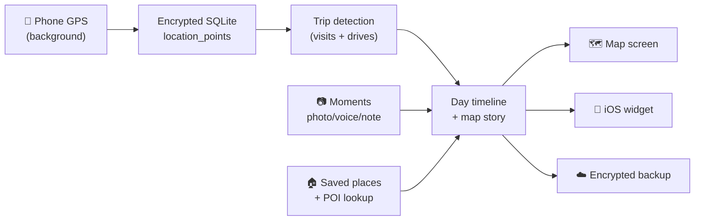

Everything flows from one raw ingredient — **location points** — enriched by **places** and
**moments**, and rendered as **your day**.

## 1.3 Technology stack

| Layer | Technology |
| --- | --- |
| **App framework** | React Native 0.84 (bare workflow, New Architecture / Fabric + TurboModules) |
| **Language** | TypeScript (strict), Swift & Kotlin for native modules |
| **UI / styling** | NativeWind v4 + Tailwind CSS v3, React Native Reusables, Lucide icons, Reanimated 4, Gorhom Bottom Sheet |
| **Navigation** | React Navigation (native-stack) — **map-first**, no tab bar |
| **State** | Zustand (persisted via AsyncStorage) |
| **Database** | SQLite via `@op-engineering/op-sqlite` with **SQLCipher** encryption; **Drizzle ORM** + Drizzle Kit migrations |
| **Location** | `react-native-background-geolocation` (TransistorSoft) + native iOS Core Location "belt" |
| **Maps** | `react-native-maps` (Apple Maps on iOS, Google on Android) |
| **Media** | Vision Camera, image-picker, video, Nitro Sound / native voice recorder, compressors |
| **Native extras** | iOS **WidgetKit** widget + App Intents, iCloud backup, Keychain |
| **Monorepo** | pnpm workspaces (`@lifemap/constants`, `@lifemap/copy`, `@lifemap/segmentation`) |
| **Crash/telemetry** | Sentry |
| **Testing** | Jest (unit, ~105 files) + Detox (E2E) |
| **CI/CD** | GitHub Actions (lint/typecheck/test) + Fastlane (TestFlight) |

## 1.4 High-level architecture

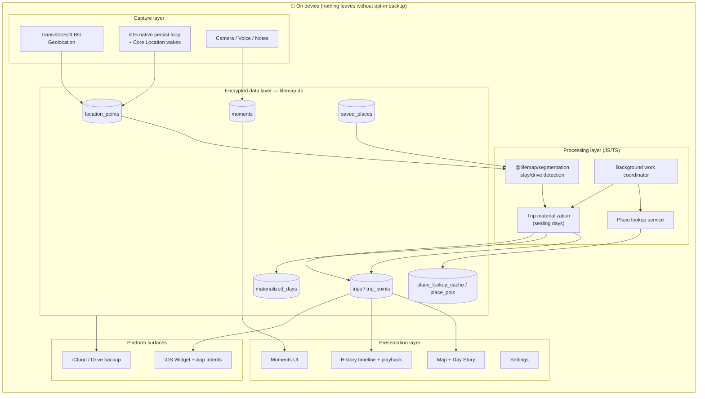

**Reading it:** raw data is captured → stored encrypted → processed into trips → displayed. The
**background work coordinator** runs the heavy processing (sealing past days, looking up place
names) when the app is idle.

## 1.5 Repository map (monorepo)

```
LifeMap/
├── App.tsx                  # Root component: splash → onboarding → main
├── index.js                 # RN entry + registers BG-geolocation headless task
│
├── src/                     # The React Native app (see Part 4)
│   ├── components/          #   UI: map/ (56 files), moments/, settings/, capture/, voice/…
│   ├── screens/             #   Map, Settings, Onboarding, capture/, moments/, backup/, sheets/
│   ├── navigation/          #   RootNavigator + route options
│   ├── stores/              #   Zustand app-store
│   ├── db/                  #   Drizzle schema + repositories/ (17 repos) + encrypted client
│   ├── lib/                 #   ~200 modules: detection, history, places, backup, widget…
│   ├── location/            #   Background tracking bootstrap + persist pipeline
│   └── hooks/               #   React hooks (useHistoryForDay, useTripPlayback…)
│
├── packages/                # Shared workspace packages
│   ├── constants/           #   Every threshold, version, color token (single source of truth)
│   ├── copy/                #   All user-facing strings
│   └── segmentation/        #   The trip-detection ALGORITHM (framework-free, reused everywhere)
│
├── point-explorer/          # Internal Vite web tool to visualize/debug GPS + trips
│
├── ios/                     # Native iOS: app, LifeMapWidget/, Shared/, Swift modules, fastlane
├── android/                 # Native Android: app module, Kotlin modules
├── drizzle/                 # 34 SQL migrations + journal
│
├── __tests__/               # ~105 Jest unit test files
├── e2e/                     # Detox end-to-end tests
├── scripts/                 # Build/run/emulator/icon dev scripts
├── docs/                    # Docs (incl. THIS file)
└── __personal__/            # Local-only real GPS dumps for testing (git-ignored, not shipped)
```

---

# Part 2 — The Data Model (the heart of everything)

> 🛠️ Technical, but worth it for everyone: **understanding these tables is understanding
> LifeMap.** The schema lives in `src/db/schema.ts`; the database is a single encrypted SQLite
> file (`lifemap.db`).

## 2.1 Entity relationship diagram

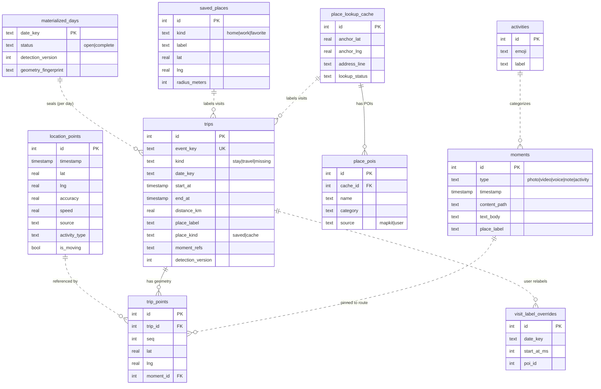

## 2.2 Table cheat-sheet

| Table | What it stores | Written by | Read by |
| --- | --- | --- | --- |
| **`location_points`** | Every raw GPS fix (append-only). The source of truth. | Tracking pipeline | Trip detection, map, benchmarks |
| **`trips`** | One row per **visit** (`stay`), **drive** (`travel`), or **gap** (`missing`) after a day is sealed. | Materialization | Map, timeline, widget, backup overrides |
| **`trip_points`** | Simplified map geometry (polyline vertices) for each trip. | Materialization | Map rendering |
| **`materialized_days`** | Per-day bookkeeping: is it sealed? what detection version? | Materialization | Fast-load decision |
| **`moments`** | Photos, videos, voice memos, notes, activity logs. | Capture flows | Moments UI, map pins, day story |
| **`saved_places`** | Home / Work / favorites (with geofence radius). | Saved places UI | Detection, geofence wakes, map |
| **`place_lookup_cache`** | Reverse-geocoded address for a stay location. | Place lookup service | Visit labels |
| **`place_pois`** | Named nearby venues (MapKit) for a cache anchor. | Place lookup service | Visit labels, POI picker |
| **`activities`** | User-defined activity types (emoji + label). | Activity capture | Activity moments |
| **`visit_label_overrides`** | User's POI pick for a still-open/unsealed visit. | Visit label picker | Materialization (merged at seal) |
| **`settings`** | Key/value app settings persisted in DB. | Various | Various |
| **`location_day_summaries`** | Lightweight per-day point counts (calendar/scheduling). | Tracking pipeline | Seal scheduling, calendar bounds |
| **`settings_stats_cache`** | Cached storage-breakdown payloads for Settings. | Settings stats | Settings UI |

## 2.3 The three trip "kinds" (product contract)

The entire timeline is built from three segment kinds that **strictly alternate**:

| Kind | Color | Meaning |
| --- | --- | --- |
| **`stay`** (visit) | 🟠 Orange `#FF9500` | You stayed within one place envelope (still or walking slowly) long enough (default ≥ 5 min; ≥ 1 min at a saved place). |
| **`travel`** (drive) | 🔵 Blue `#007AFF` | You moved quickly between two places. |
| **`missing`** (gap) | ⚪ Gray `#AEAEB2` | GPS was off/unavailable for a meaningful jump — shown honestly, not faked. |

> The rules that produce these are the **product contract** documented in
> [`docs/timeline-model.md`](./timeline-model.md): the day must always read
> *visit → drive → visit → drive …*, adjacent cards meet exactly in time (no overlaps/holes),
> and sparse GPS never draws a lying route.

---

# Part 3 — Feature Catalog

LifeMap has **~14 core features** across shipping product and internal tooling. Each links to
its deep dive in Part 4.

| # | Feature | One-liner | Type |
| --- | --- | --- | --- |
| 1 | [Background Location Tracking](#f1--background-location-tracking) | Records GPS reliably, even when app is closed | Core |
| 2 | [Trip Detection](#f2--trip-detection-visits--drives) | Turns raw points into visits & drives | Core |
| 3 | [Day Materialization](#f3--day-materialization-sealing) | Seals finished days for fast loading | Core |
| 4 | [Map & Day Story](#f4--map--day-story) | Full-screen map with your day drawn on it | Core |
| 5 | [History Timeline](#f5--history-timeline--scrubbing) | Scrub any past day's events | Core |
| 6 | [Journey Playback](#f6--journey-playback) | Replay a drive as an animated dot | Core |
| 7 | [Moments](#f7--moments-photos-videos-voice-notes-activities) | Photos/voice/notes/activities pinned in time | Core |
| 8 | [Places & POI Lookup](#f8--places--poi-lookup) | Home/Work/favorites + auto place names | Core |
| 9 | [iOS Widget & Deep Links](#f9--ios-widget--deep-links) | Home-screen widget + quick capture | Platform |
| 10 | [Backup & Restore](#f10--backup--restore) | Encrypted iCloud/Drive backups | Platform |
| 11 | [Privacy Onboarding](#f11--privacy-onboarding) | Explains encryption & permissions first | Product |
| 12 | [Settings & Theming](#f12--settings--theming) | Preferences, accent themes, dark mode | Product |
| 13 | [Point Explorer](#f13--point-explorer-dev-tool) | Web tool to debug detection | Dev tool |
| 14 | [In-app Benchmarking](#f14--in-app-benchmarking-dev) | Measure detection performance | Dev tool |

Plus cross-cutting systems covered in [Part 5](#part-5--cross-cutting-systems): app bootstrap,
the background work coordinator, and the shared monorepo packages.

---

# Part 4 — Feature Deep Dives

---

## F1 — Background Location Tracking

📸 `docs/assets/screenshots/tracking-settings.png` — *Settings → Tracking toggle*

### 🧭 What it is

The engine that quietly records where you are — reliably, in the foreground **and** background,
even after the app is force-quit or the phone reboots. This is the raw material for everything
else. Without good tracking, the timeline is empty.

### 🧭 How it feels to the user

You grant "Always" location + Motion permission once (explained during onboarding), flip
**Background tracking** on in Settings, and then forget about it. A subtle iOS notification says
*"Recording your day privately on this device."* Your days fill in automatically.

### 🛠️ How it works

There are **three cooperating layers**:

1. **TransistorSoft SDK** (`react-native-background-geolocation`) owns the GPS hardware, motion
   detection (MOVING vs STATIONARY), and a native queue.
2. **JS persist pipeline** filters each fix (drop samples, dedupe, throttle motion bursts) and
   writes rows to encrypted SQLite.
3. **iOS native "belt"** (Swift) keeps recording when JS is suspended: a 15-second drain loop,
   Core Location geofence/visit wakes around saved places, and a 90-second stale-recovery.

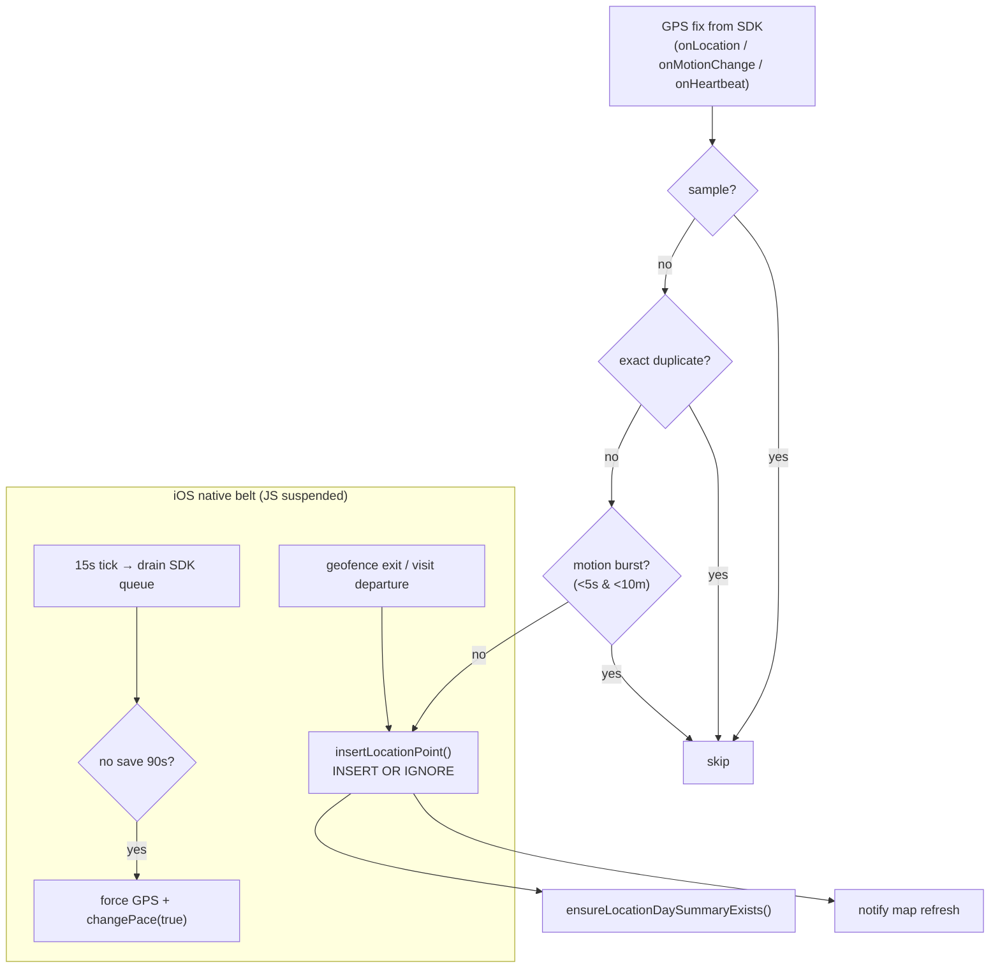

**Key thresholds** (in `packages/constants/src/index.ts`, "max reliability" profile — currently
always on):

| Setting | Value | Meaning |
| --- | --- | --- |
| Distance filter | 10 m | Minimum movement to log a new fix |
| Heartbeat interval | 30 s | Backup check cadence |
| Departure watchdog | 90 s | How fast we detect you've left a place |
| Drive wake speed | 2.0 m/s | Speed that forces "moving" mode |
| Stationary ping | 10 min | Save one "still here" ping while parked |
| Geofence min radius | 100 m | Apple reliability floor for wake regions |

### 📁 Key files

| File | Role |
| --- | --- |
| `src/location/bootstrap.ts` | Orchestrates DB → SDK config → permissions → start |
| `src/location/transistorsoft-location-service.ts` | SDK wrapper: config, listeners, start/stop |
| `src/location/location-persist-pipeline.ts` | Core: guards → insert; queue drain; heartbeat |
| `src/location/geofence-registry.ts` | Sync saved places → iOS geofences |
| `src/lib/departure-watchdog.ts` | Decide when a heartbeat means "you left" |
| `src/lib/location-save-guard.ts` | Duplicate + motion-burst guards |
| `src/lib/tracking-presets.ts` | Build the SDK config object |
| `src/db/repositories/location-points.ts` | `insertLocationPoint()` + insert listeners |
| `ios/LifeMap/LifeMapNativePersistLoop.swift` | 15s background drain loop |
| `ios/LifeMap/LocationWakeCoordinator.swift` | Core Location geofence/visit wakes |
| `index.js` | Registers the Android headless task |

### 🔑 Key functions

- `bootstrapLocationTracking()` — single entry that wires everything on launch.
- `persistLocationFromSdk()` — the main "fix → row" function.
- `runLocationHeartbeat()` — periodic catch-up (drain, fresh GPS, watchdog).
- `evaluateDepartureWatchdog()` — the "did you leave?" decision tree.

> 📄 Deeper reading: [`docs/how-location-saving-works.md`](./how-location-saving-works.md) and
> [`docs/tracking-reliability-plan.md`](./tracking-reliability-plan.md).

---

## F2 — Trip Detection (Visits & Drives)

📸 `docs/assets/screenshots/day-story-visits-drives.png` — *a day with numbered visits and blue drive routes*

### 🧭 What it is

The brain that reads a raw stream of GPS dots and decides: *"You stayed at Home 8am–9am, drove
to the office 9–9:30, stayed there until 5pm…"* It produces the alternating **visit → drive →
visit** story that defines the product.

### 🧭 The rules (the product contract)

1. **Alternating only** — never two visits or two drives in a row.
2. **Drive = moving fast** between places (uses GPS speed + implied speed + distance).
3. **Visit = slow/still inside one place envelope** for a minimum dwell time.
4. **Time continuity** — a drive ends exactly when the next visit begins; no gaps or overlaps
   between adjacent cards.

> Full contract: [`docs/timeline-model.md`](./timeline-model.md).

### 🛠️ How it works — the pipeline

The algorithm lives in the **framework-free** package `@lifemap/segmentation` so it can run
identically in the app *and* in the Point Explorer web tool. The app's thin adapter is
`src/lib/segmentation/index.ts`.

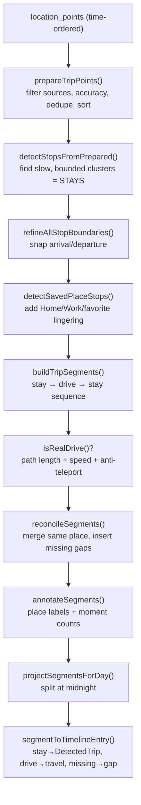

**Key thresholds** (`packages/constants/src/index.ts`):

| Concept | Constant | Default |
| --- | --- | --- |
| Minimum stay time | `DEFAULT_TRIP_DWELL_MINUTES` | 5 min |
| Stay radius | dwell radius | 75 m |
| "Moving" speed | `movingSpeedMps` | 2 m/s |
| Minimum drive distance | `MIN_DRIVE_DISTANCE_M` | 30 m |
| Merge nearby stays | `MERGE_STAY_MAX_DISTANCE_M` | 200 m |
| Gap threshold | `MISSING_MIN_DISTANCE_M` / `MISSING_MIN_GAP_MS` | 500 m / 15 min |
| Saved place dwell | `SAVED_PLACE_MIN_DWELL_MINUTES` | 1 min |
| Detection version | `TRIP_DETECTION_VERSION` | 20 |

> **`TRIP_DETECTION_VERSION`** is the magic number: bump it whenever detection rules change, and
> every sealed day auto-rebuilds because its stored version no longer matches.

### 📁 Key files

| File | Role |
| --- | --- |
| `packages/segmentation/src/stops.ts` | Stay-cluster detection (`prepareTripPoints`, `detectStops`) |
| `packages/segmentation/src/stay-boundaries.ts` | Arrival/departure refinement |
| `packages/segmentation/src/trips.ts` | `detectTrips`, `detectTripsForDay`, `buildTripSegments`, `isRealDrive`, `reconcileSegments` |
| `packages/segmentation/src/saved-places.ts` | Match points to Home/Work/favorites |
| `packages/segmentation/src/travel-geometry.ts` | Douglas–Peucker route simplification |
| `src/lib/segmentation/index.ts` | App adapter → timeline entries (`buildSegmentationTimeline`) |
| `src/lib/trip-settings.ts` | User preferences → detection config |
| `src/lib/trip-detection.ts` | Timeline types + map/display helpers |

### 🔑 Key functions

- `detectTripsForDay()` — the orchestrator (windowed on prev/day/next).
- `buildSegmentationTimeline()` — app entry that returns `DayTimelineEntry[]`.
- `isRealDrive()` — the anti-teleport gate that rejects sparse GPS chords.

---

## F3 — Day Materialization (Sealing)

### 🧭 What it is

Detection is somewhat expensive, so once a day is *finished*, LifeMap **runs detection once and
saves the result** (into `trips` + `trip_points` + a `materialized_days` row). This is called
**sealing**. Next time you open that day, it loads instantly from the stored rows instead of
re-crunching GPS.

### 🛠️ How it works

- **Past days** are sealed completely (`status: 'complete'`).
- **Today** is special: only the *finished prefix* is sealed; the **last 2 playable segments**
  stay "live" so the current visit/drive keeps updating in real time.
- A **`detection_version`** and a **`geometry_fingerprint`** are stored per day. If either no
  longer matches the current app version, the day is transparently rebuilt.
- **User visit labels survive rebuilds** via a stable `event_key` (`kind:startMs:endMs`) and
  `visit_label_overrides`.

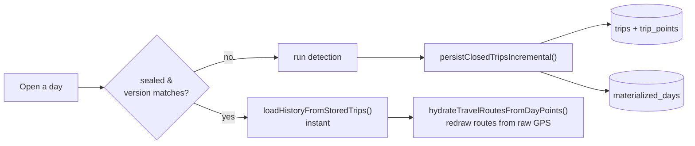

### 📁 Key files

| File | Role |
| --- | --- |
| `src/lib/trip-materialization.ts` | Seal/persist/load orchestration (`persistClosedTripsIncremental`, `loadHistoryForSelectedDay`, `sealYesterdayIfNeeded`) |
| `src/lib/timeline-from-trips.ts` | Rebuild timeline from stored rows + hydrate routes |
| `src/lib/today-sync.ts` | Merge sealed DB rows with the live "tail" |
| `src/lib/today-seal-policy.ts` | What part of *today* is safe to seal |
| `src/lib/past-day-seal-policy.ts` | Cross-midnight drive handling |
| `src/db/repositories/trips.ts`, `trip-points.ts`, `materialized-days.ts` | Storage |

---

## F4 — Map & Day Story

📸 `docs/assets/screenshots/map-day-story.png` — *day story: numbered stops + colored routes + connectors*

### 🧭 What it is

The home screen. A **full-screen map** with your day drawn on top: blue drive routes, orange
visit areas, **numbered stop cards** (e.g. `Home · 1 · 4 · 7` when you were home three times),
moment pins, and a live location puck. It opens on **today** and you can page to any past day.

### 🧭 What the user does here

- See where they are now and where they've been today.
- Long-press the map to **save a place** (Home/Work/favorite).
- Tap the floating buttons to **capture** a photo/voice/note/activity (today only).
- Tap the history button to open the **timeline** (Feature 5).
- Page **prev/next day** or pick a date from the calendar.

### 🛠️ How it works

`react-native-maps` renders a single `MapView`; overlays are layered on top. A custom location
puck is used (not the OS blue dot) to avoid the accuracy halo. The "Day Story" groups repeated
visits to the same place into a single numbered stop.

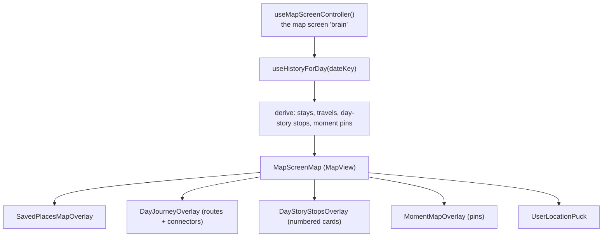

### 📁 Key files

| File | Role |
| --- | --- |
| `src/screens/MapScreen.tsx` | Composes map + floating chrome |
| `src/screens/map/use-map-screen-controller.ts` | Central state (date, layers, camera, playback) |
| `src/screens/map/MapScreenMap.tsx` | The `MapView` + overlays |
| `src/components/map/DayJourneyOverlay.tsx` | Routes + connectors for day-browse |
| `src/components/map/DayStoryStopsOverlay.tsx` | Numbered visit stop markers |
| `src/components/map/TravelModePolylines.tsx` | Solid drive / dashed walk legs + arrows |
| `src/components/map/UserLocationPuck.tsx` | Custom live-location dot |
| `src/lib/day-story-stops.ts` | Group visits into numbered stops |
| `src/hooks/use-history-data.ts` | Load/cache a day's `HistoryData` |

> The `src/components/map/` folder has ~56 components — grouped into: journey overlays, markers &
> callouts, history/timeline UI, floating buttons, and place/moment sheets.

---

## F5 — History Timeline & Scrubbing

📸 `docs/assets/screenshots/history-timeline.png` — *bottom panel: 24h timeline bar + event card*

### 🧭 What it is

Tap the history button and a bottom panel slides up with a **24-hour timeline bar**. Drag along
it to scrub through the day's events. Each event shows a **card** (place name, time range,
duration, moment chips) and the map updates to show that exact visit or drive.

### 🛠️ How it works

A day's data (`HistoryData = { dateKey, points, entries, range }`) is loaded through a
**cached, coalesced** loader. Today is always re-synced live; past days load from a fingerprinted
cache. The timeline bar is a proportional ruler; selecting an event builds a "map plan" that
frames its geometry.

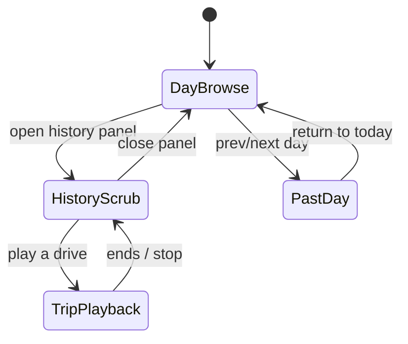

### 📁 Key files

| File | Role |
| --- | --- |
| `src/screens/map/MapHistoryPanel.tsx` | The sliding timeline panel |
| `src/components/map/HistoryTimelineBar.tsx` | Scrubbable 24h ruler |
| `src/components/map/HistoryEventCard.tsx` | Selected event card + play/zoom |
| `src/lib/history-timeline.ts` | Ruler math, segment colors, date labels |
| `src/lib/history-data-cache.ts` | In-memory LRU cache with fingerprints |
| `src/lib/history-day-load.ts` | Coalesced per-day loading |
| `src/lib/history-map-plan.ts` | Geometry for the selected event |

---

## F6 — Journey Playback

📸 `docs/assets/screenshots/journey-playback.gif` — *animated dot replaying a drive with a time chip*

### 🧭 What it is

Select a **drive** in the timeline and press **Play**: a dot travels along the route with a
floating time chip, replaying that trip like a little movie.

### 🛠️ How it works

The route is densely resampled (a point roughly every ~5 m, capped at 900 samples). A
`requestAnimationFrame` loop advances a `0→1` progress value over a fixed wall-clock duration
(~8s), and `getTripPlaybackFrame()` interpolates the dot's position, timestamp, and label
placement. To avoid MapKit dash flicker, the full route line stays drawn while only the head dot
animates. Playback progress is deliberately isolated from the rest of the UI so chrome doesn't
re-render every frame.

### 📁 Key files

| File | Role |
| --- | --- |
| `src/hooks/use-trip-playback.ts` | The rAF animation engine |
| `src/lib/trip-playback.ts` | `buildDensePlaybackSamples`, `getTripPlaybackFrame` |
| `src/components/map/TripPlaybackHead.tsx` | Animated dot + time chip |
| `src/components/map/TripRouteOverlay.tsx` | Emphasized route + endpoints |

---

## F7 — Moments (Photos, Videos, Voice, Notes, Activities)

📸 `docs/assets/screenshots/moment-capture.png` — *camera capture with filters + caption*
📸 `docs/assets/screenshots/moment-on-map.png` — *moment pins/chips on the day story*

### 🧭 What it is

The journaling layer. At any time you can capture a **photo, video, voice memo, diary note, or
activity** — and LifeMap ties it to the place and moment it happened. Later, moments appear as
**pins on the map** and **chips on visit/drive cards**, and you can open a full-screen preview
that shows *where* and *when* it was.

### 🧭 The five moment types

| Type | What you add | Extras |
| --- | --- | --- |
| **Photo** | Camera or filtered capture | Caption, optional voice memo |
| **Video** | Recorded clip | Caption |
| **Voice** | Audio memo | Optional note text |
| **Note** | Diary entry | Title, mood/emotion, attached photos + voice |
| **Activity** | A logged activity (emoji + label) | No media |

### 🛠️ How it works

Moments are **time-first**: they store a timestamp, not lat/lng. Their location is *derived* at
read time by finding which timeline entry (visit/drive) contains that timestamp, then anchoring
to the nearest route point. When a day is sealed, moment membership is baked onto trips as a
`moment_refs` JSON list for fast counts.

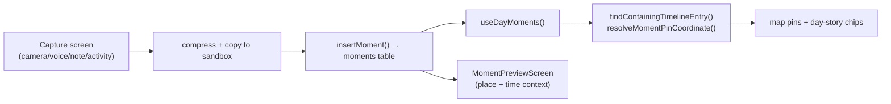

Media files live in an app sandbox (`moments/<id>.<ext>`); only the relative suffix is stored so
files survive iOS container path changes. Photos/videos are compressed; photos can optionally be
copied to the system Photos library.

### 📁 Key files

| File | Role |
| --- | --- |
| `src/db/repositories/moments.ts` | CRUD (`insertMoment`, `getMomentsForDay`, `deleteMoment`) |
| `src/screens/capture/CapturePhotoScreen.tsx` | Vision Camera photo/video capture |
| `src/screens/capture/CaptureNoteScreen.tsx` | Diary editor (text + mood + photos + voice) |
| `src/lib/moments/moment-storage.ts` | Sandbox file I/O |
| `src/lib/moments/moment-timeline.ts` | Place/time resolution (`findContainingTimelineEntry`) |
| `src/lib/moments/moment-counts.ts` | Counting/filtering per visit/drive |
| `src/lib/moment-refs.ts` | Bake moments onto sealed trips |
| `src/components/map/VoiceMemoSheet.tsx` | Shared voice recording UI |

---

## F8 — Places & POI Lookup

📸 `docs/assets/screenshots/saved-places.png` — *Home/Work/favorite pins + management sheet*

### 🧭 What it is

Two related things:

1. **Saved places** — you mark **Home**, **Work**, and up to a few **favorites**. Visits at
   these get their name automatically ("Home", "Work", "Gym").
2. **Automatic place names (POI lookup)** — for everywhere else, LifeMap reverse-geocodes the
   stay's location into a street address and (on iOS) fetches nearby named venues (MapKit POIs)
   so a visit can read *"Slim Chickens"* instead of just coordinates.

### 🧭 What the user does

- Long-press the map (or add by address) to save Home/Work/favorites.
- For an ambiguous visit, tap to pick the correct venue from a POI list; the choice sticks even
  after the day re-seals.

### 🛠️ How it works

Saved places are simple geofenced rows matched during detection (priority: home > work >
favorite). POI lookup runs in the **background work coordinator** when the app is idle: for each
unlabeled stay it checks the cache, otherwise calls a native MapKit/geocode module, stores the
result in `place_lookup_cache` + `place_pois`, then attaches the best label to the trip.

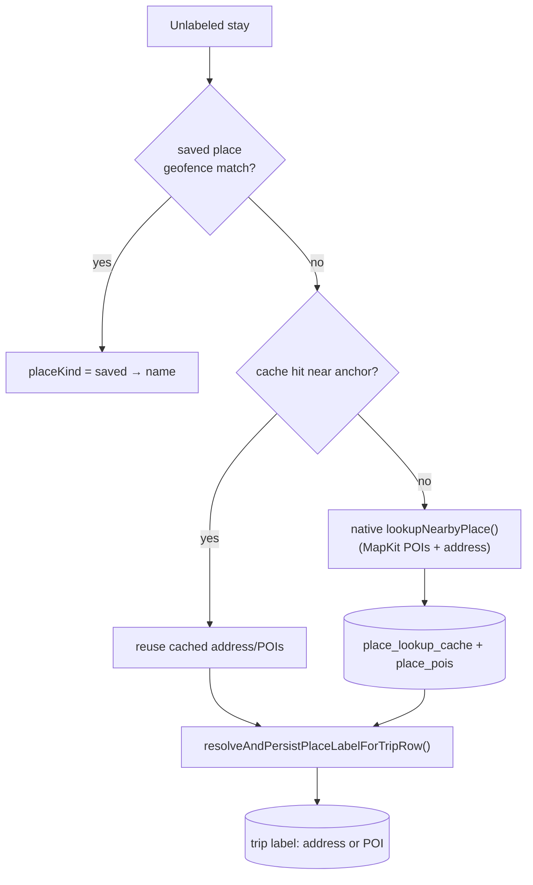

### 📁 Key files

| File | Role |
| --- | --- |
| `src/db/repositories/saved-places.ts` | Home/Work/favorite CRUD |
| `src/lib/saved-places.ts` | Geofence matching + limits |
| `src/lib/place-lookup-service.ts` | Lookup orchestration + session budget |
| `src/lib/place-lookup-native.ts` | Bridge to native MapKit/geocode |
| `src/lib/place-lookup-resolve.ts` | Attach resolved label to a trip |
| `src/lib/visit-place-label.ts` | Async visit label loader for UI |
| `src/db/repositories/place-lookup-cache.ts`, `place-pois.ts` | Cache storage |
| `ios/LifeMap/PlaceLookupModule.swift` | Native place search |

> POI auto-attach (closest venue) is **iOS-only**; Android gets address labels.

---

## F9 — iOS Widget & Deep Links

📸 `docs/assets/screenshots/ios-widget.png` — *home-screen widget with place + capture buttons*

### 🧭 What it is

A **WidgetKit** home-screen widget ("LifeMap Today") that shows where you are right now — the
place label, how long you've been there or your current drive — plus a **row of quick-capture
buttons** (diary, voice, activity, photo). iOS 18 Control Center / Lock Screen buttons do the
same. Tapping a capture button deep-links straight into that capture screen.

### 🛠️ How it works

The app and widget share data through an **App Group** container (`group.com.sunrio.lifemap`).
JS builds a small JSON snapshot (place, duration, date) and writes it there; the widget reads it.
There's also a **native-only** path: `WidgetSnapshotBuilder.swift` reads the encrypted DB
directly so the widget can refresh even when the app isn't running. Capture taps write a "pending
action" that JS drains on next foreground, or open a `lifemap://capture/...` deep link.

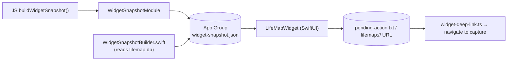

### 📁 Key files

| File | Role |
| --- | --- |
| `ios/LifeMapWidget/LifeMapWidget.swift` | Widget UI + capture action bar |
| `ios/Shared/WidgetSnapshotStore.swift` | App Group JSON read/write |
| `ios/Shared/WidgetSnapshotBuilder.swift` | Native snapshot from SQLite |
| `ios/LifeMap/WidgetSnapshotModule.swift` | JS → widget bridge |
| `src/lib/widget/build-widget-snapshot.ts` | Build snapshot from today's history |
| `src/lib/widget/widget-deep-link.ts` | Parse URLs, queue actions, navigate |

---

## F10 — Backup & Restore

📸 `docs/assets/screenshots/backup-settings.png` — *Settings → Backup with schedule options*

### 🧭 What it is

Because all data is on-device, LifeMap offers **backups** so you don't lose your life map if you
lose your phone. You can back up to **iCloud** (iOS) or share a **ZIP to Drive/Files**, manually
or on an automatic daily/weekly schedule, and **restore** on a fresh install.

### 🛠️ How it works

A backup bundles the important tables as JSON plus media files:

```
manifest.json
db/ (activities, location_points, saved_places, place_lookup_cache,
     moments, settings, trips → trip_overrides)
media/ (voice + photo files)
```

On **restore**, raw data comes back and **trips are rebuilt** from the restored GPS (rather than
importing stale materialized rows) — only your **custom visit labels** are re-applied via the
extracted `trip_overrides`.

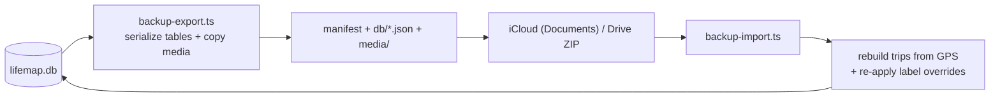

> **Current state:** the bundle is plaintext JSON (the local DB itself is SQLCipher-encrypted).
> End-to-end encrypted backups are noted as "coming later" in the backup settings UI.

### 📁 Key files

| File | Role |
| --- | --- |
| `src/lib/backup/backup-service.ts` | Orchestrates backup now / status / schedule |
| `src/lib/backup/backup-export.ts` | Serialize + write bundle |
| `src/lib/backup/backup-import.ts` | Import + rebuild trips + apply overrides |
| `src/lib/backup/backup-merge.ts` | Conflict detection/resolution |
| `src/components/settings/backup-settings.tsx` | Backup UI |
| `src/screens/backup/RestoreBackupScreen.tsx` | Fresh-install restore flow |
| `ios/LifeMap/BackupCloudModule.swift` | iCloud Documents I/O |

---

## F11 — Privacy Onboarding

📸 `docs/assets/screenshots/onboarding.png` — *animated onboarding slides*

### 🧭 What it is

The first thing a new user sees: a set of animated (Lottie) slides that explain **what LifeMap
does and why it's private** *before* asking for any permission. Only after "Get started" does iOS
show the location/motion prompts.

The four slides:

1. **See how you lived** — location history you can revisit.
2. **Capture the moment** — attach photos/voice/notes to places & times.
3. **Encrypted on your device** — SQLCipher, no server upload.
4. **Why we ask for access** — plain-language reasons for Always-location and Motion.

### 🛠️ How it works

`App.tsx` decides the active screen: `splash → onboarding → main`. Whether onboarding shows is
driven by `hasCompletedPrivacyOnboarding` in the persisted Zustand store. Slide content lives in
`src/lib/onboarding-slides.ts` (copy from `@lifemap/copy`).

### 📁 Key files

| File | Role |
| --- | --- |
| `App.tsx` | Splash/onboarding/main gating |
| `src/screens/OnboardingScreen.tsx` | The slide UI |
| `src/lib/onboarding-slides.ts` | Slide config (title/description/Lottie) |
| `src/stores/app-store.ts` | `hasCompletedPrivacyOnboarding` flag |

---

## F12 — Settings & Theming

📸 `docs/assets/screenshots/settings.png` — *Settings screen sections*

### 🧭 What it is

Where the user tunes the app. Sections:

| Section | Controls |
| --- | --- |
| **Appearance** | Accent theme (Verdant / Rose / Amethyst); app also follows system light/dark |
| **Maps & units** | Distance unit (km / mi) |
| **Tracking** | Background tracking toggle, max-reliability |
| **Trips** | Drive map update interval; (dwell time & radius live in trip preferences) |
| **Information** | Storage breakdown, Cached places, Backup |
| **Developer** | Export & developer tools |

### 🛠️ How it works

Simple preferences persist in the Zustand store (`app-store.ts`); heavier settings (storage
stats, backup status, cached-place counts) load lazily on screen focus. Theme tokens and accent
palettes come from `@lifemap/constants` (`colors.ts` / `themes.ts`) and are applied through
NativeWind + a `ThemeProvider`.

### 📁 Key files

| File | Role |
| --- | --- |
| `src/screens/SettingsScreen.tsx` | Settings list |
| `src/components/settings/tracking-settings.tsx` | Tracking toggles |
| `src/components/theme/theme-provider.tsx` | Theme application |
| `packages/constants/src/colors.ts` / `themes.ts` | Color + accent tokens |
| `src/stores/app-store.ts` | Persisted preferences |

---

## F13 — Point Explorer (Dev Tool)

📸 `docs/assets/screenshots/point-explorer.png` — *web tool visualizing GPS + detected trips*

### 🧭 What it is

An internal **web app** (Vite + React, not shipped) for debugging trip detection. You drop in a
LifeMap JSON export and see the raw points and detected trips on a desktop map — invaluable for
tuning the algorithm without rebuilding the phone app.

### 🛠️ Why it matters

Point Explorer imports the **exact same** `@lifemap/segmentation` package the app uses, so what
you see there matches the phone. It has two modes:

- **Detect** — load `location_points`, run detection live.
- **Plot** — load already-materialized `trips` + `trip_points` (no re-detection).

### 📁 Key files

| File | Role |
| --- | --- |
| `point-explorer/README.md` | Usage + formats |
| `point-explorer/src/App.tsx` | Main UI (detect/plot modes) |
| `point-explorer/src/lib/export.ts` | Parse LifeMap export JSON |
| `point-explorer/src/lib/explain.ts` | Explain segment decisions |

Run it: `cd point-explorer && pnpm install && pnpm dev` (port 5174).

---

## F14 — In-app Benchmarking (Dev)

### 🧭 What it is

A hidden developer screen that measures detection performance on real days: **Stops**, **Trips**,
and **Power** (multi-day window) modes, reporting GPS-fetch time vs algorithm time and letting you
inspect the resulting geometry on a map.

### 📁 Key files

| File | Role |
| --- | --- |
| `src/screens/benchmark/BenchmarkScreen.tsx` | Benchmark UI |
| `src/lib/benchmark/benchmark-engine.ts` | Stops/Trips/Power runners |
| `src/components/benchmark/BenchmarkMapView.tsx` | Geometry overlay |

---

# Part 5 — Cross-Cutting Systems

## 5.1 App bootstrap & lifecycle

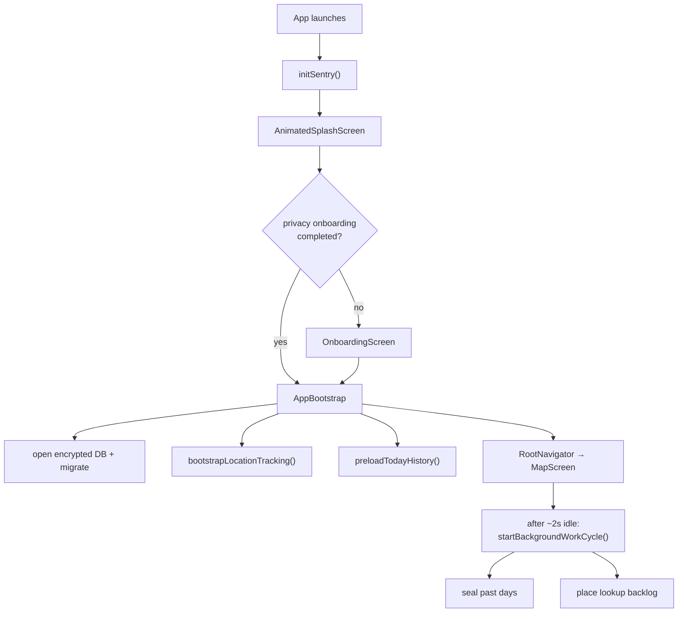

`App.tsx` is the composition root (error boundary → gesture root → bootstrap → theme → safe area
→ bottom-sheet provider → screen host). The **background work coordinator**
(`src/lib/background-work-coordinator.ts`) is the unsung hero that runs sealing and place lookups
during idle time and on foreground resume, surfacing a *"Looking up places (N/M)…"* banner.

## 5.2 The shared packages (why the monorepo exists)

| Package | Purpose | Consumed by |
| --- | --- | --- |
| **`@lifemap/constants`** | Single source of truth for **every** threshold, version number, and color/theme token. Change a detection rule here → bump `TRIP_DETECTION_VERSION` here. | app, segmentation, point-explorer |
| **`@lifemap/copy`** | All user-facing strings + label formatters (`APP_COPY`). Keeps text consistent and translatable. | app, point-explorer |
| **`@lifemap/segmentation`** | The **framework-free trip-detection algorithm**. No React, no SQLite — pure functions. This is why the app and Point Explorer produce identical results. | app (via adapter), point-explorer (directly) |

> **Golden rule:** never fork detection logic. Edit it only in `packages/segmentation`.

---

# Part 6 — Navigation Map

LifeMap is **map-first**: there is no bottom tab bar. `MapScreen` is the home; everything else is
pushed or presented as a modal/sheet over it.

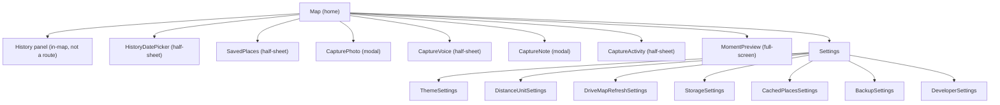

📁 `src/navigation/RootNavigator.tsx` + `src/navigation/types.ts` define all routes. Deep links
from the widget (`lifemap://capture/...`) map into the capture routes.

---

# Part 7 — Developer Workflow

## 7.1 Getting started

```bash
cd LifeMap
pnpm install

# iOS (needs full Xcode)
pnpm pod-install
pnpm start          # Metro (keep running)
pnpm ios            # build + run on device

# Android (needs JDK 17 + Android SDK)
pnpm android:emulator
pnpm android
```

## 7.2 Quality gates

| Command | What it does |
| --- | --- |
| `pnpm lint` | ESLint |
| `pnpm typecheck` | TypeScript (`tsc --noEmit`) |
| `pnpm test` | Jest unit tests (~105 files) |
| `pnpm db:generate` | Generate a new Drizzle migration |
| `pnpm e2e:run:ios` | Detox end-to-end run |

## 7.3 CI/CD

| Workflow | Trigger | Checks |
| --- | --- | --- |
| **CI** (`.github/workflows/ci.yml`) | every push/PR to `main` | lint + typecheck + test (~2 min) |
| **Mobile build** (`mobile-build.yml`) | manual | Android APK / iOS simulator compile |
| **iOS TestFlight** (`ios-testflight.yml`) | manual | Fastlane `beta` → TestFlight |

## 7.4 Testing strategy

- **Unit (Jest):** heavy coverage of detection, materialization, history/today loading, moments,
  places, backup, widget, and location persistence. This is where correctness is enforced.
- **E2E (Detox):** smoke launch + saved-places flows on simulator/emulator (not in CI yet).

## 7.5 Database migrations

Migrations live in `drizzle/` (34 entries). The runtime runner is `src/db/migrate.ts` (plus some
programmatic `ensure*` repairs). Generate new ones with `pnpm db:generate` after editing
`src/db/schema.ts`.

---

# Part 8 — Glossary

| Term | Meaning |
| --- | --- |
| **Location point** | One raw GPS fix stored in `location_points`. |
| **Trip** | A stored segment: a **stay** (visit), **travel** (drive), or **missing** (gap). |
| **Stay / Visit** | Time spent within one place envelope (orange). |
| **Drive / Travel** | Fast movement between places (blue). |
| **Gap / Missing** | A stretch with no GPS, shown honestly (gray). |
| **Segment** | A trip before it's stored — the algorithm's output unit. |
| **Materialization / Sealing** | Running detection once for a finished day and saving the result. |
| **Day Story** | The map view that groups repeated visits into numbered stops. |
| **Event key** | Stable trip identity `kind:startMs:endMs`; survives re-detection. |
| **Detection version** | `TRIP_DETECTION_VERSION`; bumping it rebuilds all sealed days. |
| **Moment** | A user capture (photo/video/voice/note/activity) tied to a time. |
| **Saved place** | Home / Work / favorite geofence. |
| **POI** | Point of interest (a named venue from MapKit). |
| **Anchor** | Representative coordinate of a stay (its center). |
| **Background work coordinator** | Idle-time worker that seals days and looks up places. |
| **The belt (iOS)** | Native Core Location fallback that records when JS is suspended. |

---

# Part 9 — "Where do I change X?" Cheat Sheet

| I want to change… | Go to… |
| --- | --- |
| A detection threshold (dwell, radius, speeds) | `packages/constants/src/index.ts` (then bump `TRIP_DETECTION_VERSION`) |
| The detection algorithm itself | `packages/segmentation/src/trips.ts` / `stops.ts` |
| Any user-facing text | `packages/copy/src/index.ts` |
| Colors / accent themes | `packages/constants/src/colors.ts` + `themes.ts` |
| How GPS is captured/filtered | `src/location/location-persist-pipeline.ts` |
| SDK tracking config | `src/lib/tracking-presets.ts` |
| The database schema | `src/db/schema.ts` (+ `pnpm db:generate`) |
| A specific table's queries | `src/db/repositories/<table>.ts` |
| Map overlays / layers | `src/components/map/*` |
| The map screen's behavior/state | `src/screens/map/use-map-screen-controller.ts` |
| History loading/caching | `src/lib/history-day-load.ts` + `history-data-cache.ts` |
| Playback animation | `src/hooks/use-trip-playback.ts` + `src/lib/trip-playback.ts` |
| A capture flow | `src/screens/capture/*` |
| Moment storage/placement | `src/lib/moments/*` |
| Saved places / POI lookup | `src/lib/saved-places.ts` / `src/lib/place-lookup-service.ts` |
| The iOS widget | `ios/LifeMapWidget/*` + `src/lib/widget/*` |
| Backup format/flow | `src/lib/backup/*` |
| Onboarding slides | `src/lib/onboarding-slides.ts` |
| App startup order | `App.tsx` + `src/components/AppBootstrap.tsx` |
| Navigation routes | `src/navigation/RootNavigator.tsx` + `types.ts` |

---

## Appendix — Related docs

| Doc | Topic |
| --- | --- |
| [`timeline-model.md`](./timeline-model.md) | The visit/drive product contract (rules) |
| [`how-location-saving-works.md`](./how-location-saving-works.md) | When GPS rows are written |
| [`tracking-reliability-plan.md`](./tracking-reliability-plan.md) | Tracking reliability roadmap |
| [`cold-start-flow.md`](./cold-start-flow.md) | Detailed app cold-start sequence |
| [`ios-testflight.md`](./ios-testflight.md) | TestFlight release setup |
| [`../README.md`](../README.md) | Setup, run, build commands |
| [`../packages/segmentation/README.md`](../packages/segmentation/README.md) | Detection package contract |
| [`../point-explorer/README.md`](../point-explorer/README.md) | Point Explorer usage |

---

> **Maintenance note:** when you ship a new feature, add it to Part 3, give it a deep dive in
> Part 4, and update the cheat sheet in Part 9. When detection rules change, update
> [`timeline-model.md`](./timeline-model.md) and bump `TRIP_DETECTION_VERSION`.
