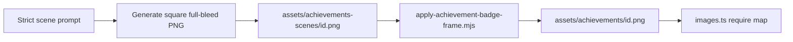

# Achievement badge art — strict rules

How LifeMap achievement badge images are created, framed, and wired into the app.
**Follow this every time** a badge is added or regenerated. Do not invent a new framing style.

Related code:

| Piece | Path |
| --- | --- |
| Badge catalog | `src/lib/achievements/catalog.ts` |
| Image `require()` map | `src/lib/achievements/images.ts` |
| Types / ids | `src/lib/achievements/types.ts` |
| PNG assets | `assets/achievements/{id}.png` |
| Gold-frame composite | `scripts/apply-achievement-badge-frame.mjs` |
| Scene-only SVG generator (legacy) | `scripts/generate-achievement-badges.mjs` |
| UI | `src/screens/you/AchievementsScreen.tsx` |
| Copy / names | `packages/copy` → `APP_COPY.achievements` |

Current count: **54 badges** (Traveler 10 + Explorer 19 + Rhythm 25).

---

## Non‑negotiable visual lock

Every shipped badge PNG **must** match all of the following:

### Canvas

| Rule | Value |
| --- | --- |
| Size | **512 × 512** px exactly |
| Format | PNG (RGB or RGBA) |
| Filename | `assets/achievements/{badgeId}.png` — id matches catalog |

### Golden frame (required on every badge)

| Rule | Value |
| --- | --- |
| Frame | **Identical** polished gold / warm bronze bezel on **all four sides** |
| Thickness | Uniform (~**36px** at 512) — never thicker on one side |
| Corners | Same outer + inner corner radius on every badge |
| Outer edge | Frame sits inside the square; **no** black/white letterbox outside the gold |
| Inner scene | Photo fills the **entire** opening — no bars, mats, or double frames inside |

The gold frame is applied by **`scripts/apply-achievement-badge-frame.mjs`**, not by the image model.
That is how we keep every badge consistent now and in the future.

### Scene (inside the frame)

| Rule | Value |
| --- | --- |
| Style | Realistic soft painterly / photographic (same family as mood of café / road samples) |
| Fill | Optional **6% center crop** per side on the source, then square `cover` into the opening |
| Subject | Meaningful to that achievement (see catalog art direction) |
| Forbidden in scene gen | Frames, borders, mats, rounded “app icon” masks, text, logos, watermarks, UI chrome |

### Display in app

| Rule | Value |
| --- | --- |
| Grid | **3** badges per row |
| Image | Show asset **as-is** — do **not** add a second `borderRadius` that clips the gold frame |
| Locked (future) | Grayscale / desaturate the **whole** badge including frame; unlocked = full color |

---

## Two-step pipeline (mandatory)



1. **Generate the scene only** (full bleed, no frame) — use the prompt template below.
2. Save the raw scene under `assets/achievements-scenes/{id}.png` (512×512 cover resize).
3. **Run the frame script** so every badge gets the **same** gold bezel.
4. Wire `require('…')` in `src/lib/achievements/images.ts` if the id is new.
5. Add catalog + copy entries if the badge is new.

Never ship a model output that drew its own frame. Never ship a scene without running the frame script.

### Install / reframe commands

```bash
# Frame every scene into the shipped assets folder:
node scripts/apply-achievement-badge-frame.mjs \
  --in assets/achievements-scenes \
  --out assets/achievements
```

`assets/achievements-scenes/` is a working folder (gitignored). Shipped art is only `assets/achievements/*.png`.

---

## Golden frame spec (canonical)

Applied only by `scripts/apply-achievement-badge-frame.mjs`:

| Property | Value |
| --- | --- |
| Canvas | 512×512 |
| Bezel thickness | ~7.8% of canvas minus 4px (~36px at 512) — **equal on all four sides** |
| Outer corner radius | 76px |
| Inner photo radius | 54px |
| Metal look | Warm gold gradient (`#FFF1C2` → `#C9962E` → `#8A6718`) + light sheen |
| Inner lip | Thin dark + light stroke around the photo opening |

Do **not** hand-tune per badge. Change the script once if the frame design changes, then re-run on all scenes.

---

## Generation prompt template (scene only)

Copy and fill `{SUBJECT}` / `{MOOD}`. Keep the STRICT block unchanged.

```text
LifeMap achievement SCENE only (frame will be added in post).

STRICT (must obey):
- EXACTLY square 1:1 composition (not landscape / widescreen)
- Subject fills the ENTIRE canvas edge-to-edge
- FULL BLEED photograph / soft painterly realism
- NO frame, NO border, NO gold trim, NO mat, NO rounded badge shape
- NO letterboxing, NO pillarboxing, NO black or white bars on any side
- NO text, NO logo, NO watermark, NO UI chrome
- Readable and clear when scaled down to ~72pt

Subject: {SUBJECT}
Mood: {MOOD}
Color harmony: warm cream, soft teal accents, natural light preferred
```

**Reference for style (optional):** attach a known good **unframed** scene from `assets/achievements-scenes/`.

If an old asset still has a model-drawn frame, regenerate the scene (or center-crop heavily) first — **never** stack a second gold frame on top of a model frame.

---

## Checklist for a new badge

- [ ] Id added to `AchievementBadgeId` + `ACHIEVEMENT_BADGES` + `APP_COPY.achievements.names`
- [ ] Scene generated with STRICT scene prompt (no frame in the image)
- [ ] Frame script applied → `assets/achievements/{id}.png` is 512×512 with gold bezel
- [ ] `ACHIEVEMENT_IMAGES` updated with static `require()`
- [ ] Visual QA in Achievements grid: same gold on all four sides, 3-up row, no clipping

---

## Why these rules exist

Earlier AI badges mixed full-bleed photos, gold frames, and rounded masks. After resize, some looked bordered on only left/right or top/bottom. **One shared post-process frame** removes that class of mistakes for every future badge.
