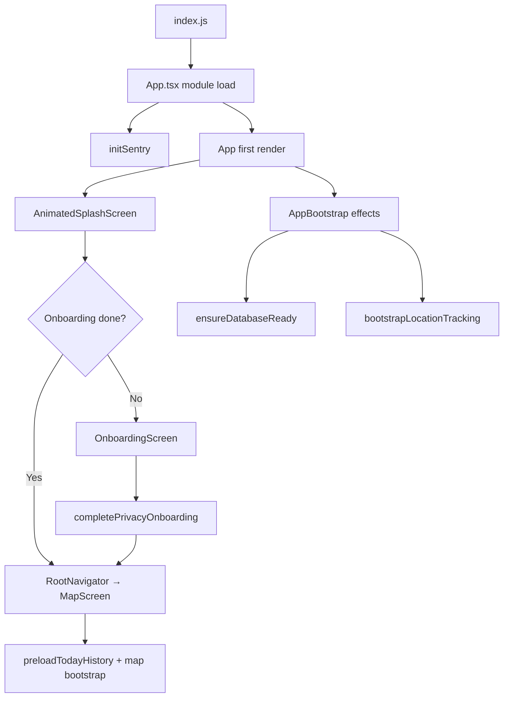

# Cold start flow (A → Z)

What runs when LifeMap launches from a killed state (normal UI cold start), with **file names**, **function names**, and **what calls what**.

There is also a separate **headless cold start** path when the OS wakes the app only for background location — covered at the end.

---

## Overview



---

## Phase 0 — JS entry (`index.js`)

**File:** `index.js`

| Step | What runs                  | Direct usage                                                                                                                                                                                  |
| ---- | -------------------------- | --------------------------------------------------------------------------------------------------------------------------------------------------------------------------------------------- |
| 1    | Side-effect imports        | `react-native-gesture-handler`, `react-native-get-random-values`, `react-native-reanimated` must load before React Native UI                                                                  |
| 2    | Headless task registration | `BackgroundGeolocation.registerHeadlessTask(handleHeadlessLocationEvent)` — only used when the app is woken in the background (see [Headless cold start](#headless-cold-start-separate-path)) |
| 3    | App registration           | `AppRegistry.registerComponent(appName, () => App)` — `appName` from `app.json` (`"LifeMap"`)                                                                                                 |

**Imports:**

- `App` from `./App`
- `handleHeadlessLocationEvent` from `src/location/transistorsoft-location-service.ts`

---

## Phase 1 — `App.tsx` module evaluation (before first paint)

**File:** `App.tsx`

| Step | Function / symbol       | File                                             | What it does                                                                                                                                                  |
| ---- | ----------------------- | ------------------------------------------------ | ------------------------------------------------------------------------------------------------------------------------------------------------------------- |
| 1    | `import './global.css'` | `global.css`                                     | Loads Tailwind / NativeWind base CSS variables (accent overridden later by `ThemeProvider`)                                                                   |
| 2    | `initSentry()`          | `src/lib/sentry/init-sentry.ts` → `initSentry()` | Calls `Sentry.init({ dsn, environment, … })` once at import time                                                                                              |
| 3    | `useAppStore` hydrate   | `src/stores/app-store.ts`                        | Zustand `persist` middleware reads `lifemap-app` from AsyncStorage (async). `hasCompletedPrivacyOnboarding` may briefly be `false` until rehydration finishes |

**Export:** `export default Sentry.wrap(App)` — wraps the root component for crash reporting.

---

## Phase 2 — First React render (`App`)

**File:** `App.tsx` → `function App()`

### Provider tree (outer → inner)

| Layer | Component                  | File                                      | Role on cold start                                                               |
| ----- | -------------------------- | ----------------------------------------- | -------------------------------------------------------------------------------- |
| 1     | `AppErrorBoundary`         | `src/components/error-boundary.tsx`       | Catches render errors; shows fallback UI                                         |
| 2     | `GestureHandlerRootView`   | `react-native-gesture-handler`            | Required root for gestures / bottom sheets                                       |
| 3     | `AppBootstrap`             | `src/components/AppBootstrap.tsx`         | **Main startup work** — DB, tracking, history preload (see Phase 3)              |
| 4     | `ThemeProvider`            | `src/components/theme/theme-provider.tsx` | Reads `accentTheme` from `useAppStore`, applies CSS vars via NativeWind `vars()` |
| 5     | `SafeAreaProvider`         | `react-native-safe-area-context`          | Safe area insets for notches / home indicator                                    |
| 6     | `BottomSheetModalProvider` | `@gorhom/bottom-sheet`                    | Context for modal bottom sheets                                                  |
| 7     | `StatusBar`                | `react-native`                            | Sets light/dark status bar from `useColorScheme()`                               |
| 8     | `PortalHost`               | `@rn-primitives/portal`                   | Mount point for portaled overlays (no portals active at cold start)              |

### Screen routing

`activeScreen` is derived in `useMemo`:

| Condition                            | Screen       | Component              | File                                             |
| ------------------------------------ | ------------ | ---------------------- | ------------------------------------------------ |
| `isSplashVisible === true` (initial) | `splash`     | `AnimatedSplashScreen` | `src/components/splash/AnimatedSplashScreen.tsx` |
| Splash done + onboarding needed      | `onboarding` | `OnboardingScreen`     | `src/screens/OnboardingScreen.tsx`               |
| Splash done + onboarding complete    | `main`       | `RootNavigator`        | `src/navigation/RootNavigator.tsx`               |

Onboarding is shown when:

```ts
!onboardingDismissed &&
  (!hasCompletedPrivacyOnboarding || (__DEV__ && devShowOnboarding));
```

Wrapped in `AppScreenTransition` (`src/components/navigation/AppScreenTransition.tsx`) for slide/fade between splash → onboarding → main.

### `App`-level effect (runs once on mount)

| Function                         | File                                 | What it does                                                                                                                                                                           |
| -------------------------------- | ------------------------------------ | -------------------------------------------------------------------------------------------------------------------------------------------------------------------------------------- |
| `startWidgetDeepLinkListening()` | `src/lib/widget/widget-deep-link.ts` | Android: reads `Linking.getInitialURL()` and subscribes to URL events. iOS: relies on native pending action + `AppState` listener. Queues widget deep links until navigation is ready. |

**`AppBootstrap`** runs the cold-start pipeline during splash (no `enableHistoryPreload` gate).

---

## Phase 3 — `AppBootstrap` (background startup work)

**File:** `src/components/AppBootstrap.tsx` → `export function AppBootstrap`

Runs **in parallel with the splash screen** for returning users.

### Effect A — always on mount

| Call                                                               | File                                 | Purpose                                                                              |
| ------------------------------------------------------------------ | ------------------------------------ | ------------------------------------------------------------------------------------ |
| `setTodayRefreshAppForeground(AppState.currentState === 'active')` | `src/lib/today-refresh-scheduler.ts` | Marks app as foreground for today-refresh timers                                     |

### Effect B — cold-start pipeline (only if `hasCompletedPrivacyOnboarding`)

**Entry:** `runTrackingBootstrap()` then `coldStart.pipeline`

| Order | Function                               | Priority | Purpose |
| ----- | -------------------------------------- | -------- | ------- |
| 1     | `ensureDatabaseReady()` + `bootstrapLocationTracking()` | critical | DB + GPS |
| 2     | `sealYesterdayIfNeeded()`              | high     | Seal yesterday; **exclude last cross-midnight drive** |
| 3     | `beginTodayOpenCycle()`                | high     | Reset silent-seal-once flag |
| 4     | `ensureHistoryCalendarBounds()`        | high     | Calendar bounds |
| 5     | `preloadTodayHistory()`                | high     | Warm today cache **during splash** |
| 6     | `scheduleTodayOpenSilentSeal()`        | low      | Background seal for today |
| 7     | `startPlaceLookupCatchUp()` (deferred) | low      | Label stays in background |

Skipped entirely until the user completes onboarding (`hasCompletedPrivacyOnboarding`).

**Milestones:** `tracking_ready` → `seal_yesterday_done` → `app_usable` → `silent_seal_scheduled`

### Effect C — `AppState` listener (foreground / background)

Registered on mount; on **foreground** (`active`) for onboarded users:

- Retries `runTrackingBootstrap()` if a prior attempt failed
- `beginTodayOpenCycle()`
- After **100 ms** idle: `warmCanonicalTravelGeometrySetting()`, `sealYesterdayIfNeeded()`, `startPlaceLookupCatchUp()`, `service.drainNativeQueue()`, `service.refreshPersistPipeline()`, `refreshTodayOnForeground()`, `scheduleTodayOpenSilentSeal()`

On **background**: `service.drainNativeQueue()`.

---

## Phase 4 — Database open (`getDatabase` → `initDatabase`)

**Triggered by:** `ensureDatabaseReady()` from splash, `AppBootstrap`, and many data hooks.

**File:** `src/db/client.ts`

| Order | Function                                      | File                        | What it does                                           |
| ----- | --------------------------------------------- | --------------------------- | ------------------------------------------------------ |
| 1     | `getOrCreateDatabaseKey()`                    | `src/db/keychain.ts`        | Reads or creates SQLCipher key in iOS/Android Keychain |
| 2     | `open({ name: 'lifemap.db', encryptionKey })` | `@op-engineering/op-sqlite` | Opens encrypted SQLite                                 |
| 3     | `PRAGMA busy_timeout = 5000`                  | `src/db/client.ts`          |                                                        |
| 4     | `drizzle(sqlite)`                             | `drizzle-orm/op-sqlite`     | ORM wrapper                                            |
| 5     | `runMigrations()` + column ensures            | `src/db/migrate.ts`         | Schema migrations and additive column repairs          |

Singleton: `initPromise` — only runs once per process unless reset in tests.

---

## Phase 5 — Splash screen

**File:** `src/components/splash/AnimatedSplashScreen.tsx` → `export function AnimatedSplashScreen`

| Step | Function                             | Purpose                                                            |
| ---- | ------------------------------------ | ------------------------------------------------------------------ |
| 1    | Subtitle fade animation              | `Animated.timing(subtitleOpacity, …)`                              |
| 2    | `ensureDatabaseReady()`              | Overlaps with `AppBootstrap` DB open (same singleton)              |
| 3    | `splashAnimationDurationMs(elapsed)` | `src/components/splash/splash-timing.ts` — minimum splash duration |
| 4    | Underline scale animation            | `Animated.timing(underlineScale, …)`                               |
| 5    | `onFinish()`                         | `App.tsx` → `handleSplashFinish()` → `setSplashVisible(false)`     |

**UI children:** `SplashBackground`, `SplashBrandTitle` (`src/components/splash/`).

---

## Phase 6 — Onboarding (first launch only)

**File:** `src/screens/OnboardingScreen.tsx` → `export function OnboardingScreen`

| User action       | Handler                        | Effect                                                                                            |
| ----------------- | ------------------------------ | ------------------------------------------------------------------------------------------------- |
| Finish last slide | `onComplete()`                 | `App.tsx` → `handleOnboardingComplete()`                                                          |
|                   | `completePrivacyOnboarding()`  | `src/stores/app-store.ts` — sets `hasCompletedPrivacyOnboarding: true`, persisted to AsyncStorage |
|                   | `setOnboardingDismissed(true)` | Local React state — allows transition to main even in `__DEV__` with `devShowOnboarding`          |

After onboarding completes, **Effect B** in `AppBootstrap` runs tracking bootstrap for the first time.

**Not run during onboarding:** location tracking bootstrap, history preload, yesterday seal.

---

## Phase 7 — Main app (`RootNavigator`)

**File:** `src/navigation/RootNavigator.tsx` → `export function RootNavigator`

| Piece             | Function / component                                              | File                                                       | Cold-start behavior                                                           |
| ----------------- | ----------------------------------------------------------------- | ---------------------------------------------------------- | ----------------------------------------------------------------------------- |
| Navigation shell  | `NavigationContainer`                                             | `@react-navigation/native`                                 | Hosts stack navigator                                                         |
| Ready callback    | `handleNavigationReady` → `setWidgetNavigationRef(navigationRef)` | `src/lib/widget/widget-deep-link.ts`                       | Lets widget deep links navigate once nav is ready                             |
| Initial screen    | `Map` → `MapScreenWithBoundary`                                   | `src/screens/MapScreen.tsx`                                | First screen user sees                                                        |
| Error boundary    | `withFeatureErrorBoundary(MapScreen, 'map')`                      | `src/components/error-boundary.tsx`                        | Isolates map crashes                                                          |
| Background runner | `ScheduledBackupRunner`                                           | `src/components/backup/ScheduledBackupRunner.tsx`          | **Does not run on cold start** — only on `background/inactive → active`       |
| UI runner         | `PlaceLookupCatchUpRunner`                                        | `src/components/place-lookup/PlaceLookupCatchUpRunner.tsx` | Renders progress strip only if `startPlaceLookupCatchUp()` is already running |

---

## Phase 8 — Map screen (first meaningful UI work)

**Files:** `src/screens/MapScreen.tsx` → `useMapScreenController()` in `src/screens/map/use-map-screen-controller.ts`

### Data loading (on mount)

| Hook / call                                           | File                                     | Purpose                                                                          |
| ----------------------------------------------------- | ---------------------------------------- | -------------------------------------------------------------------------------- |
| `useHistoryForDay(selectedDateKey, { active: true })` | `src/hooks/use-history-data.ts`          | Loads today’s timeline from `historyDataCache` or DB via `beginHistoryDayLoad()` |
| `useSavedPlaces()`                                    | `src/hooks/use-saved-places.ts`          | Saved home/work/favorites                                                        |
| `useDayMoments(selectedDateKey)`                      | `src/hooks/use-day-moments.ts`           | Moments for selected day                                                         |
| `useLatestLocationSave()`                             | `src/hooks/use-latest-location-save.ts`  | Timestamp of last GPS save                                                       |
| `useTripDetectionConfig()`                            | `src/hooks/use-trip-detection-config.ts` | Dwell radius / minutes from app store + settings                                 |

### Map bootstrap (on mount)

| Call                                       | File                                     | Purpose                                                                             |
| ------------------------------------------ | ---------------------------------------- | ----------------------------------------------------------------------------------- |
| `resolveMapBootstrapRegion()`              | `src/lib/map-bootstrap-region.ts`        | `getLatestLocationPoint()` → center map on last known GPS, or `MAP_FALLBACK_REGION` |
| `registerWidgetSheetHandlers({ refresh })` | `src/lib/widget/widget-deep-link.ts`     | Registers widget “refresh” handler                                                  |
| `refreshWidgetSnapshotIfStale()`           | `src/lib/widget/sync-widget-snapshot.ts` | Updates iOS home-screen widget data if stale                                        |

### Subcomponents rendered

| Component                   | File                                            |
| --------------------------- | ----------------------------------------------- |
| `MapScreenMap`              | `src/screens/map/MapScreenMap.tsx`              |
| `MapDayLoadingOverlay`      | `src/components/map/MapDayLoadingOverlay.tsx`   |
| `MapScreenFloatingControls` | `src/screens/map/MapScreenFloatingControls.tsx` |
| `MapHistoryPanel`           | `src/screens/map/MapHistoryPanel.tsx`           |
| `MapScreenTopBar`           | `src/screens/map/MapScreenTopBar.tsx`           |
| `SavePlaceSheet`            | `src/components/map/SavePlaceSheet.tsx`         |

---

## Timeline — returning user (typical cold start)

| Time         | What’s running                                                                                                   |
| ------------ | ---------------------------------------------------------------------------------------------------------------- |
| T+0 ms       | `index.js` imports, `initSentry()`, `App` mount, splash visible                                                  |
| T+0 ms       | `AppBootstrap` Effect A + B start; `startWidgetDeepLinkListening()`                                              |
| T+0 ms       | `ensureDatabaseReady()` begins (splash + bootstrap share same promise)                                           |
| T+? ms       | DB open + migrations complete                                                                                    |
| T+? ms       | `bootstrapLocationTracking()` — configure BG geo, permission, start tracking                                     |
| T+splash min | Splash animation done → `setSplashVisible(false)` → `RootNavigator` mounts                                       |
| T+splash     | `enableHistoryPreload` becomes `true` → `beginTodayOpenCycle()` + deferred preload                               |
| T+2 s idle   | `sealYesterdayIfNeeded()`, `startPlaceLookupCatchUp()`, `preloadTodayHistory()`, `scheduleTodayOpenSilentSeal()` |
| T+map mount  | `resolveMapBootstrapRegion()`, `useHistoryForDay`, widget snapshot refresh                                       |

---

## What does **not** run on cold start

| Item                            | File                               | Why                                                                            |
| ------------------------------- | ---------------------------------- | ------------------------------------------------------------------------------ |
| `maybeRunScheduledBackup()`     | `src/lib/backup/backup-service.ts` | `ScheduledBackupRunner` only fires after a prior `background`/`inactive` state |
| Full foreground resume pipeline | `AppBootstrap` AppState effect     | Only on `AppState` change to `active`, not initial mount                       |
| `Portal` content                | `@rn-primitives/portal`            | No overlays portaled at launch                                                 |
| Headless location handler       | `handleHeadlessLocationEvent`      | Separate OS wake path (below)                                                  |

---

## Headless cold start (separate path)

When the app process is started **only** for a background location event (UI may never mount):

| Step | Function                                              | File                                              |
| ---- | ----------------------------------------------------- | ------------------------------------------------- |
| 1    | OS starts JS runtime                                  | `index.js`                                        |
| 2    | `BackgroundGeolocation.registerHeadlessTask` callback | `handleHeadlessLocationEvent(event)`              |
| 3    | Event dispatch                                        | `src/location/transistorsoft-location-service.ts` |

| Event          | Handler                                                                  |
| -------------- | ------------------------------------------------------------------------ |
| `Location`     | `persistLocationFromSdk()` → `src/location/location-persist-pipeline.ts` |
| `Heartbeat`    | `runLocationHeartbeat()`                                                 |
| `MotionChange` | `handleMotionChangePersist()`                                            |

No `App`, `AppBootstrap`, splash, or map code runs on this path.

---

## Quick reference — top-level entry functions

| Function                       | File                                              | Called from                                        |
| ------------------------------ | ------------------------------------------------- | -------------------------------------------------- |
| `handleHeadlessLocationEvent`  | `src/location/transistorsoft-location-service.ts` | `index.js` (headless only)                         |
| `initSentry`                   | `src/lib/sentry/init-sentry.ts`                   | `App.tsx` (module scope)                           |
| `App`                          | `App.tsx`                                         | `AppRegistry.registerComponent`                    |
| `AppBootstrap`                 | `src/components/AppBootstrap.tsx`                 | `App.tsx` render                                   |
| `ensureDatabaseReady`          | `src/location/bootstrap.ts`                       | `AppBootstrap`, `AnimatedSplashScreen`, data layer |
| `bootstrapLocationTracking`    | `src/location/bootstrap.ts`                       | `AppBootstrap.runTrackingBootstrap`                |
| `startWidgetDeepLinkListening` | `src/lib/widget/widget-deep-link.ts`              | `App.tsx` `useEffect`                              |
| `AnimatedSplashScreen`         | `src/components/splash/AnimatedSplashScreen.tsx`  | `App.tsx` when `activeScreen === 'splash'`         |
| `OnboardingScreen`             | `src/screens/OnboardingScreen.tsx`                | `App.tsx` when onboarding required                 |
| `RootNavigator`                | `src/navigation/RootNavigator.tsx`                | `App.tsx` when `activeScreen === 'main'`           |
| `useMapScreenController`       | `src/screens/map/use-map-screen-controller.ts`    | `MapScreen`                                        |

---

## Related docs

- [How location saving works](./how-location-saving-works.md) — GPS persist pipeline after tracking starts
- [Tracking reliability plan](./tracking-reliability-plan.md) — bootstrap timing and foreground resume design
